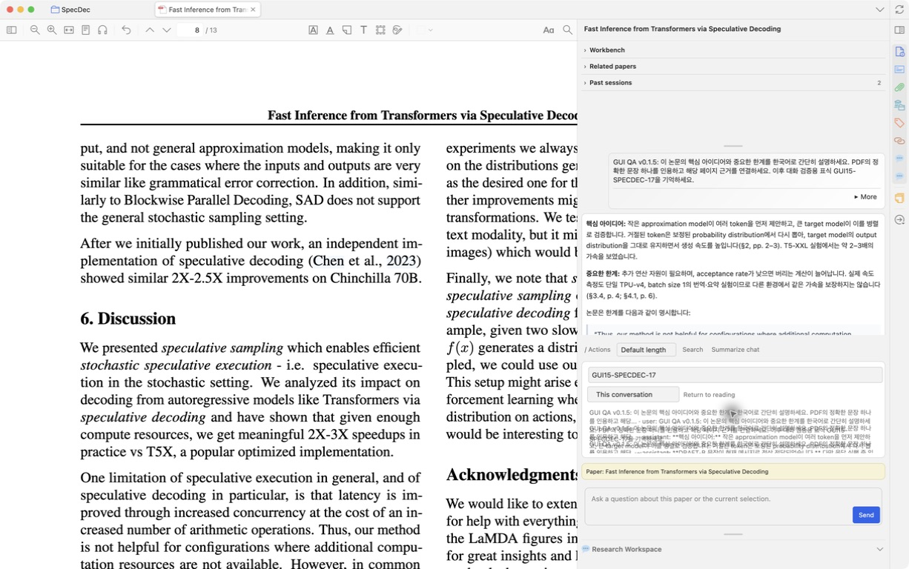
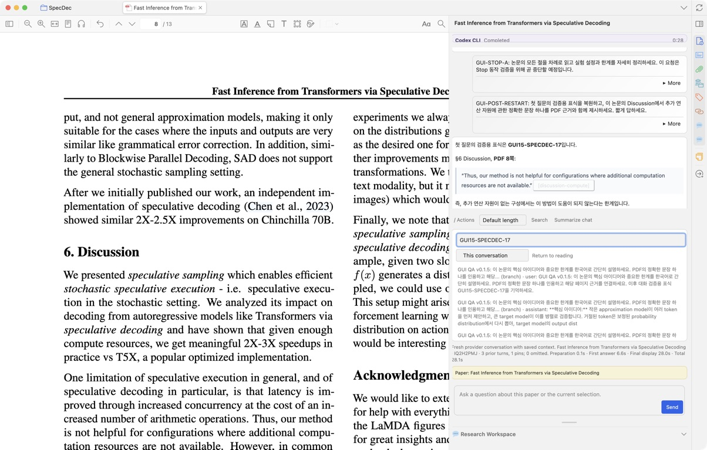

# Chat runtime repair specification

This follows the [product review and chat specification](./paperpilot-product-review-and-chat-spec.md). The baseline is published v0.1.5, commit `2ac58b4795050e69fa59579f927b04db749c0b09`. Native Zotero screen control found issues that the Node suite did not exercise.

## Observed failures

| ID      | Reproduction                                                                                                                                                                                       | Expected behavior                                                                  |
| ------- | -------------------------------------------------------------------------------------------------------------------------------------------------------------------------------------------------- | ---------------------------------------------------------------------------------- |
| GUI-F01 | A fresh answer quotes Discussion on PDF page 8, but the citation says “PDF unavailable”. The same passage is visible in the Reader. The installed XPI calls a development-only bare PDF.js import. | Read the admitted local PDF, match the complete quote, and open the verified page. |
| GUI-F02 | An older answer cannot be saved as a note after attachment version 577 becomes 582. Recorded size, mtime and dateModified are identical.                                                           | Distinguish version-only sync drift from changes to the observed PDF metadata.     |
| GUI-F03 | Three conversation search results wrap at narrow pane width and their text overlaps adjacent buttons.                                                                                              | Each result grows with its text while the list remains scrollable.                 |

## Requirements and boundaries

### GUI-F01: packaged PDF extraction

- Inside Zotero, import its PDF.js module through a chrome Window with a module ScriptLoader. Read the exact admitted file into a new document.
- Create a dedicated Worker and PDFWorker. Pass that worker explicitly, avoiding shared GlobalWorkerOptions and the Reader's document or worker.
- Extract every page so a duplicate quote on a later page remains ambiguous. Release the owned loading task, PDFWorker and Worker on success and failure.
- Preserve exact library, parent and attachment checks, full-quote matching and freshness checks before and after verification.
- Retain the Node PDF fixture path outside Zotero. Do not introduce a Node executable requirement into the native path.
- Saved failed citations are not automatically promoted. This repair applies when a new answer is verified or a verification is explicitly invoked. Previously disabled citations remain historical; asking again performs a new verification.
- The native resource module is a Zotero implementation capability. Runtime compatibility is recorded separately for each exercised Zotero version.

### GUI-F02: conservative request freshness

- Keep the existing immutable snapshot and fingerprint format.
- In request validation only, accept a different version component when both v1 strings have numeric safe-integer version, file size and mtime, a known SQL dateModified, and identical size, mtime and dateModified.
- Preserve exact comparison for other formats and incomplete metadata. A changed size, mtime or dateModified, missing file, or rebound source still fails.
- Do not migrate snapshots, alter provider-binding comparisons, or relax project artifact/checkpoint reuse.
- Metadata equality is not byte equality. The existing v1 format cannot detect replacement bytes that preserve size and timestamps. This repair does not claim otherwise.

### GUI-F03: native search layout

- Override native button height/block-size constraints only inside the search-result list.
- Preserve wrapping, visible focus, keyboard activation, full-width targets and bounded vertical scrolling.

## Independent specification review

The independent reviewer requested explicit worker ownership (native PDF.js does not honor the old disableWorker option), cleanup on failures, strict parsing of colon-containing dateModified values, immutable snapshots, honest metadata limitations, and clear treatment of historical failed citations. These requirements are included above. The original reader-iframe proposal was replaced after a native diagnostic successfully loaded a separate PDF document through the main Window.

## Acceptance and release evidence

Automated checks cover owned-resource cleanup, exact path selection, preserved Node fixture extraction, version-only drift and rejection of changed/unknown metadata. Native UI evidence must independently cover:

- Fresh answer with an enabled citation; clicking it opens the exact PDF page, and the Reader remains usable.
- Extraction with no PDF reader open and with a different PDF visible, without changing the source.
- Old-answer note preview/save after version-only drift; missing/rebound or observably changed source remains blocked.
- Wrapped Korean search results, long unbroken strings, keyboard activation and visible focus at narrow width.
- Restart persistence of the previously created branch and summary.

Record the installed artifact identity, exact checks performed, failures and untested combinations. Do not replace an already published version or claim the entire manual-QA matrix passed from a subset.

## Executed native validation

Screen-controlled validation used Zotero 10.0.1 on macOS 26.6.2 (arm64), Codex CLI with the configured GPT-6-Astra model, and the public paper _Fast Inference from Transformers via Speculative Decoding_. Its exact PDF attachment was retained throughout.

The published v0.1.5 XPI SHA-256 was `ddd0548c3c09e5c32200629e03ea23f740dc8b21c3ffda974d189d3118798021`. The first repair candidate retained version 0.1.5 only for local verification and had SHA-256 `abd996a73fbf06dd67e17738c43325f0fe80ede5f930f749cbff9a72093eb64d`; the installed profile XPI matched it. It was installed through Plugins Manager and Zotero was normally quit and restarted. This candidate was not substituted for the published release.

| Check                                      | Observed result                                                                                                                                                                                                                                                                                                                   |
| ------------------------------------------ | --------------------------------------------------------------------------------------------------------------------------------------------------------------------------------------------------------------------------------------------------------------------------------------------------------------------------------- |
| New real chat answer                       | Completed in 28.1 seconds; citation displayed “PDF passage matched”. Persisted citation status was verified with zero-based page index 7.                                                                                                                                                                                         |
| Citation activation                        | Clicking the enabled citation moved the reader page field from 9 to 8. The existing Reader remained available.                                                                                                                                                                                                                    |
| Previously blocked note                    | The first QA answer's original snapshot produced a destination preview and saved under its original paper. The Save button became disabled and the saved status appeared. One additional QA note was created.                                                                                                                     |
| Search layout                              | Four matching messages displayed in a scrollable list without overlapping text at approximately 420 px pane width. Tab reached a result and Enter jumped to the original question.                                                                                                                                                |
| Branch and summary persistence             | The saved branch reopened after restart; its summary and pin remained in the durable session. Historical failed citation labels remained unchanged, as specified.                                                                                                                                                                 |
| Prior lifecycle checks on published v0.1.5 | Real Korean questions, continuity after restart, Stop retaining a draft, retry without duplicate user turns, Focus chat after restart, slash actions without auto-send, response length, pin, branch, and note preview/save were exercised. The initially interrupted summary was subsequently confirmed completed and persisted. |

Before the search layout repair:

After the repair:

The screen-control service intermittently returned blank screenshots and timeouts; those captures are excluded from the evidence above. Successful accessibility observations, actual saved records and the valid native screenshots are reported separately from Node checks.

Not exercised in this follow-up: Zotero 7–9, native extraction with all PDF readers closed or another paper visible, the full 320/640 px and dark/200%/IME matrix, 200-message history, two PDFs under one parent, Claude/Gemini GUI, and the full project/privacy matrix. Negative source-change cases are covered by automated logic tests; no user PDF was replaced or deleted for QA. These remain manual-QA gaps, not passed checks.
