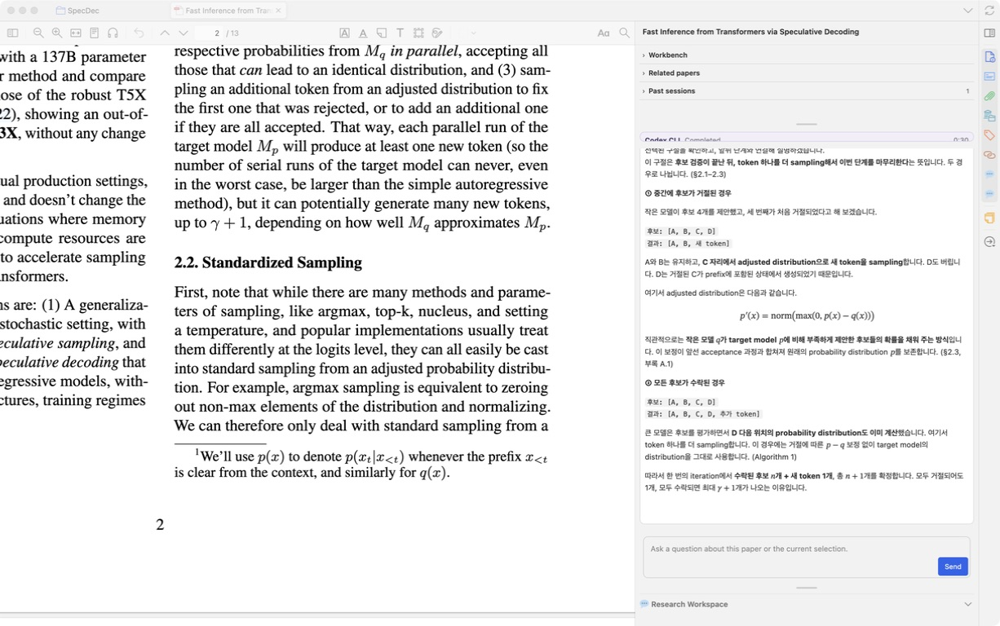

# PaperPilot 제품 리뷰와 Chat 개선 스펙

작성일: 2026-09-07 KST  
상태: **독립 리뷰 반영 스펙 · 구현과 검증 기록은 §13 참조**
기준: 최신 `origin/main`의 `bb6a67275bbb83e668a5aa76c6e280a317a12a2d`  
주요 사용자 요구: PDF를 읽으며 가장 자주 사용하는 **chat의 신뢰성·연속성·사용성 개선**

## 1. 범위와 증거의 경계

이 문서는 현재 제품의 결함, 설계 제약, 불필요한 복잡성, 사용 시나리오,
UI/UX 및 외부 프로젝트의 참고 아이디어를 검토하고 구현 가능한 요구사항으로
정리한다. 아래 요구사항은 아직 구현 완료를 뜻하지 않는다. 사용자의 후속 지시에
따라 **R01–R13과 A–D 전체를 구현·검증하고 PR merge 후 v0.1.5 release까지
완료하는 것**이 이번 전달 범위다. 단계는 작업 순서이며 후속 버전으로 미루는
범위 구분이 아니다. 이 문서 마지막의 구체 계약이 기존 제안형 표현에 우선한다.

- 리뷰 시작 시 `git fetch --prune origin main` 실행 후 `HEAD`와 `origin/main`이
  같은 SHA이며 ahead/behind가 `0/0`임을 확인했다.
- 과거 빌드용 detached worktree 1개는 main에 포함된 커밋이며, 변경 소스나
  미추적 사용자 파일이 없었다. 생성된 빌드·의존성만 있는 것을 확인하고 제거했다.
- 기존 `package-lock.json` 수정과 사용자 미추적 폴더는 보존했다. 자동 검사는
  현재 설치된 의존성에서 수행했으며, clean install 결과로 해석하지 않는다.
- 구현 사실은 현재 코드와 실행한 제품 함수로 확인했다. 과거 스펙의
  “현재 상태” 설명은 현재 구현 증거로 사용하지 않았다.
- 실제 Zotero의 기존 대화 화면을 관찰했다. 설치 XPI와 기존 로컬 XPI는
  동일했지만, manifest에는 소스 SHA가 없어 화면을 해당 커밋의 런타임 증명으로
  취급하지 않는다. 새 AI 질문이나 라이브러리 쓰기는 수행하지 않았다.

증거 표기는 다음과 같다.

| 표기         | 의미                                                            | 주장할 수 없는 것                    |
| ------------ | --------------------------------------------------------------- | ------------------------------------ |
| E1 함수 재현 | 현재 제품 함수를 Node에서 실행, 필요 시 메모리 파일 어댑터 사용 | 실제 Zotero·CLI 왕복 성공/실패       |
| E2 코드 확인 | 호출 경로, 전달 값, 분기 및 저장 규칙을 확인                    | 모든 OS·Zotero 버전의 실제 증상      |
| E3 화면 관찰 | 이번 실행에서 캡처·검수한 설치본 화면                           | 미관찰 화면, 현재 SHA 전체 런타임 QA |
| P 제품 제안  | 사용자 시나리오에 근거한 개선                                   | 기존 기능이 고장 났다는 단정         |

소스 링크는 저장소 상대 경로이며, 함께 적은 줄 번호는 위 기준 SHA의 번호다.
P1은 잘못된 입력·연속성·근거 전달을 우선 해결할 항목, P2는 빈번한 사용성 및
설계 개선, P3는 효과 검증 후 확장할 항목이다. 노력 S/M/L은 각각 국소 수정,
여러 모듈 변경, 저장 형식·런타임 QA를 포함하는 변경의 상대 크기다.

## 2. 종합 판단

PaperPilot은 이미 분석 기능이 풍부하다. 현재 가장 큰 개선 여지는
**사용자가 묻는 대상, 모델이 실제로 읽는 대상, 저장한 대화, 화면에서 확인할 수
있는 근거가 끝까지 일치하도록 만드는 것**이다. 특히 일반 chat은 Research
Workspace보다 출처 확인과 구조화된 상태 보존이 약하다.

유지할 강점은 다음과 같다.

- 하나의 Zotero add-on과 세 local CLI를 사용하는 구조.
- 논문별 실행 admission, 취소·타임아웃·종료 정리, chat과 숨은 분석 실행의 구분.
- 선택 구절 action, Past sessions, New session, Copy, Markdown·수식 렌더링.
- 48-message DOM window와 별도로 전체 대화를 유지하는 구조.
- 정확한 PDF 식별·추출 cache와 fallback, 프로젝트별 저장소·revision·복구.
- Research Workspace의 로컬 인용구 대조, 근거 탐색, screening, Evidence Matrix,
  Claim Ledger, synthesis, Living Review. 이 기능들을 신규 기능처럼 다시 만들
  필요는 없다.

근거: [architecture.md](./architecture.md),
[chatTranscriptWindow.ts](../src/modules/ui/chatTranscriptWindow.ts) 1–2,
[evidenceVerification.ts](../src/modules/researchWorkspace/evidenceVerification.ts),
[evidenceNavigation.ts](../src/modules/researchWorkspace/evidenceNavigation.ts).

추천 순서는 **입력·세션 무결성 → 매일 쓰는 chat UX → chat 결과 재사용 →
프로젝트 작업 연결 → 검색·그림 이해의 성능 실험**이다.

## 3. 우선 해결할 결함

### D01. 대화 제목이 작업 폴더와 논문 metadata에 섞인다

**P1 · M · E1/E2**

첫 질문을 저장하면 session 제목이 첫 질문에서 만들어진다. 그런데
`persistUserMessage()`는 제목이 갱신되기 전 객체를 반환하고, controller는
`sessionTitle`을 runner의 `title`로 넘긴다. 이 값이 폴더 경로와 논문 metadata에
함께 사용된다.

제품 함수 재현 결과:

```text
첫 실행 title: Actual Paper Title
다음 실행 title: Explain the proposed mechanism
첫 경로 suffix: 987654-actual-paper-title
다음 경로 suffix: 987654-explain-the-proposed-mechanism
pathsDiffer: true
```

따라서 같은 대화의 후속 질문에서 CWD가 바뀌고, 논문 제목에 질문 제목이
기록될 수 있다. 실제 CLI가 이때 반환하는 오류는 별도 QA 대상이다.

**변경:** 논문 제목, 대화 표시 제목, 불변 session/source identity를 분리한다.
경로는 표시 제목에 의존하지 않는다. **인수:** 첫 질문·후속 질문·이름 변경·재시작
전후 같은 대화의 실행 identity가 유지되고 metadata의 title은 서지 제목이다.

근거: [sessionHistoryService.ts](../src/modules/session/sessionHistoryService.ts)
181–217; [claude/controller.ts](../src/modules/claude/controller.ts) 175–184;
[claude/runner.ts](../src/modules/claude/runner.ts) 155–162, 231–236;
[pathBuilder.ts](../src/modules/workspace/pathBuilder.ts) 32–39.
Codex/Gemini에도 같은 title 전달 패턴이 있다.

### D02. Claude/Gemini의 저장 대화와 provider 대화가 고유하게 연결되지 않는다

**P1 · M/L · E2**

첫 성공에 실제 provider session ID를 수집하지 않고 `latest`를 저장한다.
Claude는 이를 `--continue`, Gemini는 `--resume latest`로 실행한다. 특정 PaperPilot
대화를 다시 여는 동작이 provider의 특정 대화를 가리킨다는 보장이 없다.
D01의 CWD 변경 및 동일 slug를 갖는 대화와 결합하면 연속성 위험이 커진다.

**변경:** 설치 CLI가 지원하는 출력에서 실제 ID를 획득한다. 확인되지 않은 ID는
“재개 가능”으로 표시하지 않는다. 재개할 수 없으면 저장한 context로 새 provider
대화를 시작하는 상태를 설명한다. **인수:** 같은 논문에서 A/B 대화를 만든 뒤
A→B→A로 열어도 질문과 답변이 섞이지 않는다. 한국어 제목과 재시작을 포함한다.
실제 CLI 버전별 혼선 발생 여부는 아직 실행 검증하지 않았다.

근거: [sessionHistoryService.ts](../src/modules/session/sessionHistoryService.ts)
83–94; [claude/controller.ts](../src/modules/claude/controller.ts) 397–407;
[gemini/controller.ts](../src/modules/gemini/controller.ts) 397–407;
[claude/runner.ts](../src/modules/claude/runner.ts) 107–110;
[gemini/runner.ts](../src/modules/gemini/runner.ts) 110–112.

### D03. 정확한 attachment를 확보해도 runner에서 다른 PDF를 다시 읽을 수 있다

**P1 · M/L · E1/E2**

Research Workspace는 선택한 child PDF를 정확하게 읽지만, 분석 실행에는
anchor의 parent `itemID`만 넘긴다. runner는 그 item의 첫 PDF로 root workspace를
다시 만든다. 프로젝트 projection은 supplemental files로 추가되므로, 선택한
PDF B와 다른 PDF A가 한 요청의 자료에 함께 들어갈 수 있다. 공통 prompt는
root `paper.md`를 읽으라고도 지시한다.

같은 parent에 PDF A/B를 둔 함수 재현에서, 명시적 attachment 옵션을 사용한
읽기는 B를, runner 형태의 `getPaperContent(parent)`는 A를 반환했다.
실제 PDF 파일 대신 명확히 구분되는 가짜 attachment text로 검증했다.

일반 chat 역시 전역 활성 reader에서 selection과 page를 서로 다른 시점에
조회하고, parent를 받으면 첫 PDF를 선택한다. 다중 reader 창·빠른 탭 전환의
실제 발생 조건은 Zotero QA로 확정해야 한다.

**변경:** admission에서 얻은 source snapshot을 추출→prompt→저장→근거 이동까지
전달한다. 프로젝트 실행은 해당 run의 허용된 projection만 제공한다.
**인수:** B에서 시작한 질문의 입력 파일 전체에 A가 없고, 직후 탭을 전환해도
source/page/selection이 바뀌지 않는다.

근거: [facade.ts](../src/modules/researchWorkspace/facade.ts) 163–176;
[analysisRunner.ts](../src/modules/researchWorkspace/analysisRunner.ts) 52–64;
[codex/runner.ts](../src/modules/codex/runner.ts) 149–176;
[readerContext.ts](../src/modules/context/readerContext.ts) 1–22;
[promptPreviewBuilder.ts](../src/modules/context/promptPreviewBuilder.ts) 44, 64–70.

### D04. Annotation Explain/Summarize가 주석 내용을 전달하지 않는다

**P1 · M · E1/E2**

annotation 메뉴는 ID만 전달한다. draft가 있으면 reader context 조회는 생략되고,
workspace에는 ID 문자열 배열만 저장된다. 구절·comment·page·position을 모델이
확인할 수 있는 입력으로 만들지 않는다.

```json
{
  "annotationRequest": "Explain the selected passage in the context of this paper.",
  "selection": { "annotationIDs": ["ANNOTATION_A"], "retrievedChunks": [] },
  "annotations": ["ANNOTATION_A"],
  "selectedTextPresent": false
}
```

**변경:** 해당 library/attachment에서 annotation의 실제 text/comment와 locator를
해석해 snapshot으로 만든다. **인수:** 서로 다른 주석 설명 요청은 각각의 구절을
받는다. 삭제된 주석은 누락을 알리고, image annotation은 이미지 전달 여부를
구분한다. 메뉴와 같은 입력으로 제품 함수를 연결한 재현이며 실제 메뉴 실행은
아직 검증하지 않았다.

근거: [readerActions.ts](../src/modules/readerActions.ts) 194–204;
[readerPane.ts](../src/modules/readerPane.ts) 4368–4377;
[workspaceArtifacts.ts](../src/modules/context/workspaceArtifacts.ts) 152–159;
[codex/runner.ts](../src/modules/codex/runner.ts) 223.

### D05. 제외한 프로젝트 논문을 분석하고 완료로 저장할 수 있다

**P1 · M · E1/E2**

일반 분석 coordinator는 source가 member이고 ready이며 fingerprint가 같으면
통과시킨다. `reviewStatus === excluded`는 확인하지 않는다. synthesis도 입력받은
`papers`로 context를 만들면서 coverage에는 같은 source를 제외했다고 기록할 수
있다. 파생 분석 경로에는 이미 제외 검사가 있어 두 경로의 규칙이 다르다.

메모리 저장소로 재현한 결과: `memberStatus=excluded`, `analysisExecuted=true`,
`artifactStatus=complete`, `runStatus=completed`.

**변경:** run scope에 screening 결정을 적용하고, 실행 전·저장 전 동일 revision과
범위를 확인한다. **인수:** 제외 source는 기본 prompt·분석 결과·사용한 자료 수에
들어가지 않는다. 제외 논문을 재검토하는 명시적 작업은 별도 run scope로 기록한다.

근거: [operationCoordinator.ts](../src/modules/researchWorkspace/operationCoordinator.ts)
131–152, 168–185; [facade.ts](../src/modules/researchWorkspace/facade.ts)
598–615, 645–660.

### D06. stale 또는 이번 범위 밖의 과거 artifact를 모델에 제공한다

**P1 · M · E1/E2**

project workspace builder는 claim card와 prior artifacts에서 `superseded`만
제외한다. stale claim의 payload와 이번 선택에 없는 source의 artifact payload가
실제로 생성 파일에 들어가는 것을 재현했다. 상태 필드는 남아 있으나,
“stale 자료를 현재 근거로 사용하지 않았다”는 synthesis 설명과 입력 경계가
일치하지 않는다. 모델이 실제로 이를 인용했는지는 재현하지 않았다.

**변경:** complete 여부뿐 아니라 source 범위·fingerprint·upstream lineage가
맞는 artifact만 현행 근거로 제공한다. 과거 결과 비교가 목적이면 사용자에게
보이는 historical scope로 분리한다. **인수:** stale/out-of-scope payload는 기본
workspace에 없고, 허용된 upstream artifact만 lineage에 기록된다.

근거: [projectWorkspaceBuilder.ts](../src/modules/researchWorkspace/projectWorkspaceBuilder.ts)
61–65, 102–110, 127–152;
[facade.ts](../src/modules/researchWorkspace/facade.ts) 629–639.

### D07. 명시적으로 요청한 공개 출처 URL도 영구적으로 제거한다

**P1 · M · E1/E2**

prompt는 사용자가 요청한 링크를 허용하지만, 정제 함수와 Markdown renderer는
링크를 일반 텍스트로 바꾼다. messageStore에도 정제된 결과가 들어가므로 Copy와
저장 대화 재열기에서도 원래 링크를 복구할 수 없다.

```text
입력: Official source: [Paper](https://example.org/paper)
출력 및 저장: Official source: Paper
```

**변경:** 내부 파일 경로 정제, 공개 URL, 로컬 PDF locator를 서로 구분한다.
**인수:** 요청한 공개 URL은 화면·Copy·재시작 후 유지되고 허용 scheme만 열린다.
`file:`, `javascript:` 및 Zotero privileged URL을 모델이 임의로 실행시키지 못한다.

근거: [promptPreviewBuilder.ts](../src/modules/context/promptPreviewBuilder.ts) 51;
[assistantOutput.ts](../src/modules/message/assistantOutput.ts) 14–28;
[markdownRenderer.ts](../src/modules/components/markdownRenderer.ts) 66;
[messageStore.ts](../src/modules/message/messageStore.ts) 33–45.

### D08. 답변 갱신이 사용자의 읽는 위치를 강제로 바꾼다

**P2 · M · E2**

assistant 내용 갱신은 현재 스크롤 위치와 무관하게 즉시 및 다음 두 animation
frame에서 최하단으로 이동한다. controller의 800ms polling 갱신과 결합하면
대기 중 위쪽 답변을 읽거나 선택하는 동작을 방해한다. 기존 테스트도 위로 올린
상태에서 강제 이동하는 것을 성공 조건으로 검사한다.

**변경:** 마지막 위치를 따라가는 상태와 과거 내용을 읽는 상태를 분리한다.
동일한 진행 문구에는 DOM을 다시 만들지 않는다. **인수:** 위쪽에서 스크롤·선택·
키보드 탐색을 하면 위치가 유지되고, 새 답변은 이동 버튼으로 접근한다. 사용자가
최하단을 보고 있었을 때의 자연스러운 follow 동작도 보존한다.

근거: [ChatMessage.ts](../src/modules/components/ChatMessage.ts) 84–117;
[claude/controller.ts](../src/modules/claude/controller.ts) 351–364;
[chatMessage.test.ts](../test/chatMessage.test.ts) 223–256.
이번 리뷰에서는 긴 실행 중 실제 스크롤 증상까지 실행하지 않았다.

### 추가 결함과 현재 설계 제약

| ID  | 분류·우선순위·노력 | 현재 확인된 동작과 영향                                                                                                               | 변경 및 인수 기준                                                                                                               | 근거                                                                                                                                                                   |
| --- | ------------------ | ------------------------------------------------------------------------------------------------------------------------------------- | ------------------------------------------------------------------------------------------------------------------------------- | ---------------------------------------------------------------------------------------------------------------------------------------------------------------------- |
| D09 | E2 · P2 · M        | pane template 재생성에 textarea draft 복원이 없다. 선택 action은 기존 입력을 덮고, 전송은 준비·저장 전에 질문과 draft를 비운다        | item/session별 초안과 붙인 context 보존. 재렌더·준비 실패·준비 중 Stop 이후 회복 가능                                           | [readerPane.ts](../src/modules/readerPane.ts) 389–398, 3227–3235, 4351–4365                                                                                            |
| D10 | E2 · P2 · M        | Retry가 질문을 새 user message로 다시 저장한다. 실패 반복이 대화와 최근 context를 채운다                                              | 질문 하나에 execution attempt를 묶기. 3회 재시도해도 질문은 하나이며 시도 이력은 남음                                           | [retryEngineRequest.ts](../src/modules/ai/retryEngineRequest.ts) 56–63                                                                                                 |
| D11 | E1 · P2 · S/M      | context coverage의 분자는 구분자를 포함하고 분모는 제외해 `8 → 10 / 8 = 1.25`가 나온다. 짧은 논문의 남은 quota도 재배분하지 않는다    | 원문 포함량과 직렬화 길이를 분리. coverage는 0–1. 한 source가 짧아도 다른 source의 유효 문맥을 예산 안에서 사용                 | [contextPlanner.ts](../src/modules/researchWorkspace/contextPlanner.ts) 128–143, 179–205                                                                               |
| G01 | E2/P · P2 · M      | 생성 중 textarea가 disabled라 다음 질문을 메모할 수 없다                                                                              | 입력 작성 허용, 추가 실행은 기존 admission으로 차단. 자동 queue는 초기 범위에서 제외                                            | [chatComposer.ts](../src/modules/ui/chatComposer.ts) 7–19, 30–31                                                                                                       |
| G02 | E2/P · P2 · M      | workspace의 최근 context는 문답 세 쌍이 아닌 메시지 3개이며 현재 질문도 포함된다. provider 전환·재개 실패 시 초기 전제가 빠질 수 있다 | 재개 상태, 고정 사용자 전제, bounded continuity context 제공. 정상 provider resume가 유지하는 맥락까지 유실된다고 단정하지 않음 | [messageStore.ts](../src/modules/message/messageStore.ts) 24–30; [codex/runner.ts](../src/modules/codex/runner.ts) 224–230                                             |
| G03 | E2/P · P2 · M      | 저장 프로젝트에 member가 있어도 `capturedPapers`가 없으면 분석 controls 대신 새 PDF 선택 안내만 보인다                                | 저장 member에서 명시적으로 run scope 복원. 새 selection 없이 프로젝트 재분석 가능                                               | [projectWindowView.ts](../src/modules/researchWorkspace/projectWindowView.ts) 251–274                                                                                  |
| G04 | E2/P · P2 · M      | screening 결정과 읽기 진행이 `reviewStatus`를 공유한다. screening event가 있으면 읽기 progress select가 비활성화된다                  | inclusion/screening과 reading progress 분리. 포함한 논문을 읽음/이해함으로 독립 변경 가능                                       | [projectReviewPanels.ts](../src/modules/researchWorkspace/projectReviewPanels.ts) 1051–1084                                                                            |
| G05 | E2/P · P2 · M      | 추천 추가는 metadata와 collection 추가이며 PDF 확보·프로젝트 편입은 아니다. PDF 없는 selection은 skip된다                             | 발견 후보→Zotero 등록→PDF 준비→프로젝트 포함→분석 상태를 연결. PDF 없는 후보도 잃지 않음                                        | [relatedRecommendations.ts](../src/modules/relatedRecommendations.ts) 1147–1205; [selectionSnapshot.ts](../src/modules/researchWorkspace/selectionSnapshot.ts) 123–155 |
| G06 | E2/P · P2 · M      | 프로젝트 home을 표시하기 전에 캡처 PDF들을 모두 load한다                                                                              | 저장 프로젝트 탐색은 먼저 제공하고 PDF는 실제 분석 준비 때 load. 지연시간은 측정 후 비교                                        | [window.ts](../src/modules/researchWorkspace/window.ts) 205–227                                                                                                        |
| G07 | E2/P · P2 · S      | 이전 redesign spec의 Audit basis가 과거 결함을 “current facts”로 유지한다                                                             | 이전 baseline에 SHA/시점을 명시하고 현재 계약은 architecture/prompt docs로 연결                                                 | [research-workspace-redesign-spec.md](./research-workspace-redesign-spec.md) 52–56, 68–88                                                                              |

D11의 불균형 예시: 총 180,000자 예산에서 100자 source와 250,000자 source를
함께 처리하면 90,100자만 사용하고 160,000자를 생략했다. 이는 알고리즘의
예산 사용 문제를 보여주며, 특정 질문의 답변 품질 저하까지 측정한 결과는 아니다.

## 4. UI/UX 및 디자인 리뷰

### 이번에 관찰한 흐름

| 단계 | 관찰                                                       | 상태·한계                                                                                                |
| ---- | ---------------------------------------------------------- | -------------------------------------------------------------------------------------------------------- |
| 1    | 기존 PDF와 완료된 긴 chat 답변, 수식, 입력창을 관찰·캡처   | 읽기와 질문 입력이 한 화면에 존재. 답변의 section/page 표시는 보이지만 클릭 가능한 근거 UI는 보이지 않음 |
| 2    | Workbench를 펼쳐 기능·비활성 controls를 접근성 트리로 확인 | 기능 접근은 확인. 후속 screenshot은 반복해서 빈 이미지가 반환되어 시각 증거에서 제외                     |
| 3    | Workbench를 원래 접힌 상태로 복구                          | 접근성 트리에서 복구 확인. 새 질문·설정 변경·데이터 쓰기 없이 종료                                       |

아래는 1단계에서 실제 저장 후 다시 열어 검수한 유일한 채택 화면이다.
2단계 이후 레이아웃·색상·반응형 동작은 완전한 시각 audit을 했다고 주장하지 않는다.



### 유지할 요소와 바꿀 요소

| 관점        | 판단과 개선                                                                                                                                                              | 확인 방법                                                                                        |
| ----------- | ------------------------------------------------------------------------------------------------------------------------------------------------------------------------ | ------------------------------------------------------------------------------------------------ |
| Chat 집중   | 기능을 찾는 세 disclosure와 큰 resize 영역보다 질문·답변·입력에 우선권을 준다. 신규 사용자용 집중 기본값은 제안하되 기존 disclosure/size 설정은 보존한다                 | 320/420/640 CSS px pane에서 질문 완료. chat 선택 시 주요 작업 controls 때문에 입력이 밀리지 않음 |
| 입력 대상   | 현재 선택은 draft 경로에서 180자 또는 annotation ID 목록으로만 보인다. source·page·구절을 확인하고 제거할 수 있는 compact context chip이 필요하다                        | 구절 선택→Ask AI→추가 질문→전송 직전 같은 자료인지 확인                                          |
| 긴 대화     | 답변을 통째로 다시 읽지 않아도 질문·사용한 구절·답변을 한 turn으로 추적할 수 있어야 한다                                                                                 | 접힌 구절 펼치기, 이전 질문 검색, 새 답변 이동을 키보드로 수행                                   |
| 답변 재사용 | Copy 다음 단계가 멀다. 답변별 메뉴에 수정·분기·노트 저장을 제공한다                                                                                                      | 한 답변의 원 질문과 인용을 포함해 preview 후 note 생성                                           |
| Typography  | 현행 token은 11/12/13px 중심이며 입력은 13px이다. 화면상 밀도는 높다. 본문은 native text scaling을 따르고, 14–16px 상당의 편안한 읽기 크기를 초기 디자인 후보로 검증한다 | 작은 폰트가 곧 접근성 위반이라고 단정하지 않음. 확대·긴 한국어·수식·표로 실제 가독성 평가        |
| 색상·위계   | 기존 native theme token을 유지한다. 완료 상태가 답변보다 강해지지 않게 하고, 상태는 색 외에 문구로 구분한다                                                              | light/dark에서 직접 대비 측정. 스크린샷만으로 WCAG 준수 주장 금지                                |
| 조작 크기   | 읽기 영역을 해치지 않는 범위에서 주요 controls에 최소 24 CSS px 목표, 잦은 입력 action에는 더 큰 hit area를 적용한다                                                     | 포인터·키보드·확대 상태에서 실제 target 측정                                                     |
| 언어        | 응답 언어와 UI locale을 구분한다. 한국어 답변의 English technical terms 보존 및 현재 Critical Read 명칭 정책은 유지한다                                                  | 한국어 IME Enter와 Shift+Enter, English term 유지, 기존 이름에 익숙한 사용자 회귀 확인           |
| 진행 표시   | Preparing/Running/Finishing은 이미 있다. 같은 status를 답변처럼 반복하지 않고 실패 후 할 수 있는 행동을 보여준다                                                         | 첫 click부터 feedback, Stop 이후 정리 완료, 재시도 가능 여부 관찰                                |

코드 근거: [paneSectionState.ts](../src/modules/ui/paneSectionState.ts) 5–9;
[readerPane.ts](../src/modules/readerPane.ts) 3270–3285;
[ChatMessage.ts](../src/modules/components/ChatMessage.ts) 134–166;
[zoteroPane.css](../addon/chrome/content/zoteroPane.css) 83–86, 668–811.

디자인 목표는 새 brand나 장식적 card system 도입이 아니라, Zotero에서 논문을
읽는 흐름 안에 chat의 대상·진행·근거·다음 행동을 명확히 배치하는 것이다.

## 5. 사용 시나리오와 목표 동작

| ID  | 사용자 상황                                         | 목표 동작                                                 | 연결 항목             |
| --- | --------------------------------------------------- | --------------------------------------------------------- | --------------------- |
| S01 | 한 문장이 이해되지 않아 Explain 후 계속 질문        | 구절·page·논문 고정, 짧은 답변, 후속 대화 유지            | D01–D04, R01–R02      |
| S02 | 긴 논문을 30분 이상 읽으며 예전 답변을 다시 찾기    | 스크롤 유지, 대화 검색, 고정한 정의·전제 확인             | D08, G02, R06/R09     |
| S03 | 답변 생성 중 다음 질문 작성                         | 초안 작성 가능, 현재 run만 실행, 완료해도 초안 유지       | D09, G01, R04         |
| S04 | Claude↔Codex↔Gemini 전환 또는 며칠 뒤 재개        | 정확한 session 또는 명시적 새 실행, 이어받는 context 설명 | D01/D02, G02, R02/R06 |
| S05 | 잘못 질문했거나 답변을 다른 방향으로 발전           | 질문 수정 또는 선택 답변에서 독립 session 분기            | D10, R03/R08          |
| S06 | 본문 PDF와 supplementary PDF를 함께 보유            | 이번 질문에서 실제 선택한 attachment만 분석               | D03, R01              |
| S07 | 내 하이라이트 여러 개와 comment로 질문              | 선택한 annotation 내용과 출처를 확인 후 포함              | D04, R01              |
| S08 | “공식 링크와 이 주장의 근거를 보여줘”               | 공개 링크 보존, 로컬 quote 대조, 해당 PDF로 이동          | D07, R05              |
| S09 | 그림·수식·표를 설명해 달라고 요청                   | 텍스트만 읽었는지 실제 image도 보냈는지 구분              | R01/R10/R13           |
| S10 | group library, 삭제·교체된 PDF, 오프라인 상태       | 동일 title의 다른 source로 대체하지 않고 범위·실패를 표시 | D03/D06, R01/R05      |
| S11 | 저장한 프로젝트를 열어 현재 포함 논문으로 재분석    | library 재선택 없이 corpus에서 실행 범위 복원             | D05/D06, G03/G06, R11 |
| S12 | 관련 논문 발견 후 PDF 확보·screening·비교·정리      | 후보 상태를 보존하고 읽기/포함/분석 상태를 독립 관리      | G04/G05, R12          |
| S13 | 좋은 chat 답변을 연구 노트·Evidence Matrix로 옮기기 | 질문·출처·검증 상태 포함한 preview, 원본 대화로 돌아가기  | R05/R08/R12           |
| S14 | 기록 저장을 끈 채 질문하거나 prompts-only 사용      | 새 초안·인용·요약 기능도 기존 privacy 범위 준수           | R02/R04/R06           |

## 6. 구현 요구사항

아래 MUST는 해당 phase를 구현 완료로 표시할 때의 인수 조건이다. 전체 항목을
한 PR에서 구현하라는 뜻이 아니다. 기존 실행 reservation과 종료 확인 계약을
유지하며, 표시 개선 때문에 중복 CLI 실행이나 정리 중 session 교체를 허용하지 않는다.

### R01. 한 번 캡처한 자료를 끝까지 사용하는 요청 계약

**Phase A · MUST · D03/D04 대응**

- 요청 admission에서 같은 reader 또는 명시적 project scope로부터 source
  identity, fingerprint, selection, page, annotation 내용을 한 번 캡처한다.
- 최소 source identity는 `libraryID + itemKey + attachmentKey`다. parent item ID는
  lifecycle owner로 사용할 수 있지만 PDF identity를 대신하지 않는다.
- 이후 runner는 활성 reader를 다시 읽어 입력을 바꾸지 않는다. 기존
  `paperWorkspaceContentCache`의 exact attachment/source 옵션을 재사용한다.
- page index와 표시 page label을 분리한다. `0` 기반 index를 그대로 사용자에게
  page 0이라고 보이거나 로마 숫자 page label과 혼동하지 않는다.
- annotation은 key, quote, comment, page/position, source identity를 담는다.
  source 확인 실패 시 그 annotation은 입력에서 제외하고 이유를 표시한다.
  해당 주석이 Explain의 유일한 대상이면 실행하지 않고 재선택할 수 있게 한다.
- project 실행은 admitted source projection과 허용된 upstream artifacts만
  사용한다. anchor의 다른 PDF를 root context로 추가하지 않는다.
- 첨부 내용이 바뀌면 기존 답변은 보존하되 근거 상태를 stale로 바꾼다.

**검증:** 두 attachment, 두 library, 두 reader 창, 전송 직후 탭 전환,
annotation 삭제, 이미지 주석, extraction fallback을 포함한다. 생성된 모든 입력
파일의 source 집합이 admission snapshot의 집합과 일치해야 한다.

### R02. 대화 표시와 실행 identity 분리

**Phase A · MUST · D01/D02 대응**

- `paperTitle`, `conversationTitle`, `sessionId`, provider session ID를 분리한다.
  표시 제목을 바꿔도 실행 위치가 바뀌지 않는다.
- CLI별 실제 ID 획득은 설치 버전의 capability를 확인해 구현한다. 특정 새 flag가
  항상 지원된다고 가정하지 않는다. ID가 없으면 legacy `latest`를 정확한 재개로
  승격하지 않는다.
- 이전 대화 열기·이름 변경·분기에는 그 session의 source 및 provider binding만
  적용한다. 다른 대화의 최신 provider ID를 가져오지 않는다.
- 화면은 “이전 대화 재개”, “저장한 맥락으로 새 대화”, “재개 불가”를 구분한다.
  모델이 앞의 대화를 기억한다고 확인 없이 보장하지 않는다.
- path 변경의 migration은 기존 session metadata로 식별한 inactive 경로만
  다룬다. 사용자 설정 workspace root·cleanup·history 정책을 유지한다.

**검증:** 세 provider에서 A/B/A 재개, 동일 첫 질문, 한글 이름, 재시작,
legacy session, provider ID 없음. metadata.title의 서지 제목 일치를 검사한다.

### R03. 문답과 실행 시도 분리

**Phase B · MUST · D10 대응**

- 하나의 사용자 질문을 logical turn으로 두고 그 아래 attempt를 연결한다.
  재시도는 원 질문을 다시 저장하지 않는다.
- 실패·취소·완료 이력은 남기되 오류 문구와 중복 질문이 정상 대화 context를
  차지하지 않게 한다. partial answer를 완료 답변으로 취급하지 않는다.
- provider가 실패한 시도 일부를 이미 저장했을 수 있다. 정확한 checkpoint를
  재개할 수 없으면 마지막 완료 turn까지의 context로 새 provider 실행을 만든다.
- 기존 메시지는 additive migration으로 읽을 수 있어야 한다. 단순히 문자열이
  같다는 이유로 기존 대화의 반복 질문을 삭제하지 않는다.

**검증:** 준비 실패, 실행 실패, 저장 실패, Stop, 3회 Retry 후 성공;
질문은 하나, attempt와 진단은 추적 가능, 중복 실행은 없다.

### R04. 초안 보존과 생성 중 작성

**Phase B · MUST · D09/G01 대응**

- composer draft를 item/session별로 관리한다. 본문과 붙인 context를 함께 복원한다.
- 실행 중에도 다음 질문 작성은 허용한다. Send 실행은 reservation이 허용할 때만
  가능하고 Stop은 실행 상태와 별도로 도달 가능해야 한다. 자동 queue는 만들지 않는다.
- Ask AI는 기존 질문을 덮는 대신 selection을 context로 붙인다. 즉시 실행하는
  Explain/Summarize/Translate도 기존 초안을 조용히 지우지 않는다.
- 준비 실패·준비 중 취소에는 원 요청을 다시 편집할 수 있다. 늦게 도착한 완료
  callback이 다음 초안을 지우지 못한다.
- 우선 in-memory draft 복원으로 구현한다. 디스크 초안 복원은 history 정책을
  따르는 별도 범위이며 저장 비활성화 상태에서 숨은 persistence를 추가하지 않는다.

**검증:** pane 재렌더, 탭/engine 전환, Enter·Shift+Enter·한국어 IME,
selection action, Stop, 늦은 callback에서 작성 내용과 context가 보존된다.

### R05. 출처 링크와 확인 가능한 PDF 근거

**Phase A: 링크 복구 MUST · Phase C: 로컬 근거 탐색 MUST**

- 내부 경로 마스킹과 공개 URL 처리를 분리한다. 허용된 공개 링크는 표시·Copy·
  persistence·export에서 보존한다. 사용자 요청을 어기는 일괄 URL 삭제를 제거한다.
- 일반 chat의 답변에도 source-bound citation candidate를 연결할 수 있게 한다.
  후보는 quote와 locator를 포함하며 모델이 스스로 `verified`를 부여하지 않는다.
- 기존 Research Workspace verifier/navigation을 공통 근거 모듈로 재사용한다.
  검증을 위해 두 번째 모델 요청을 필수로 만들지 않는다.
- candidate 수집을 위해 구조화된 envelope를 사용할 경우
  `answerMarkdown + citationCandidates`를 지원하고 prompt/parser 계약을 함께
  변경한다. envelope가 없거나 parsing에 실패하면 읽을 수 있는 답변을 보존하고
  근거는 미확인으로 표시한다. prose의 page 숫자만으로 검증 상태를 만들지 않는다.
- 사용자에게는 “PDF 구절 일치”, “위치 미확인”, “자료 변경됨”을 구분해 보여준다.
  quote가 존재한다는 사실은 주장 타당성·entailment·논문 결론의 진실을 증명하지 않는다.
- quote 일치와 현재 fingerprint를 확인한 경우에만 정확한 library/attachment로
  이동한다. 웹 출처는 “외부 자료”로 구분한다.

**검증:** 정확/부정확 인용, 위조 source ID, 다른 library의 같은 key, 변경 PDF,
잘못된 page, 링크 scheme 공격, Copy·재열기·export round trip.

### R06. 긴 대화와 provider 전환의 맥락

**Phase C · MUST · G02 대응**

- native resume 성공 여부와 별개로 현재 전달한 context 범위를 기록한다.
- fallback context는 사용자가 고정한 전제·정의, 최근 완료 문답, 필요한 선택 구절을
  우선한다. 길이 상한을 갖고 원 transcript는 그대로 보존한다.
- 요약은 모델이 만든 요약임을 표시하고 생성 기준 마지막 message ID와 source
  fingerprint를 기록한다. 요약을 검증된 논문 근거로 취급하지 않는다.
- 먼저 명시적인 “대화 정리”와 pinned context를 제공한다. 매 질문마다 추가 모델을
  호출하는 자동 요약은 측정 없이 도입하지 않는다.
- prompts-only와 history off에서 assistant 답변을 몰래 요약·저장하지 않는다.

**검증:** 첫 질문의 사용자 정의를 10회 문답 후 provider 전환에서 이어받기;
오래된 요약·요약 실패·분기·history off 동작을 확인한다.

### R07. Chat 중심 레이아웃과 읽기 위치

**Phase B · MUST · D08 및 디자인 대응**

- 기본 작업 영역을 chat, workbench, project로 이해할 수 있게 유지한다.
  chat 집중 모드는 기존 기능의 진입점을 보존하면서 transcript와 composer를 우선한다.
- 기존 사용자 disclosure/resize 설정은 migration에서 보존한다. 새 기본값을
  적용하기 위해 사용자의 선택을 일괄 초기화하지 않는다.
- 답변 follow-scroll은 사용자가 마지막 부분을 보는 상태에서만 동작한다.
  위쪽을 읽으면 anchor와 selection을 유지하고 “새 답변 보기”를 제공한다.
- DOM windowing은 유지한다. 화면에 없는 메시지를 삭제한 것으로 설명하지 않는다.
- primary controls·input·source chips가 320px pane에서 가로로 잘리지 않아야 한다.
  표·수식·code는 자기 영역에서 스크롤하고 전체 pane을 넓히지 않는다.
- Tab/Enter/Space/Escape, focus 복귀, screen reader status announcement,
  native font scaling·light/dark를 실제 Zotero에서 확인한다.

**검증:** 200-message 대화, 긴 표·수식·code, 읽기 중 새 답변, pane 폭
320/420/640px 및 확대 상태. composer가 화면 밖으로 밀리는 경로를 확인한다.

### R08. 답변 수정·분기·저장

**Phase C · MUST**

- 메시지 메뉴는 Copy, 질문 수정, 여기서 새 대화, 노트로 저장을 우선한다.
  주요 action을 매 답변 아래 큰 버튼 묶음으로 상시 펼치지 않는다.
- 최초 분기는 선택한 답변까지 복사한 독립 session으로 구현한다. 원래 session을
  보존하고 이후 메시지를 복사하지 않는다. 전체 DAG editor는 필요하지 않다.
- 새 session에 원 provider ID를 그대로 재사용해 원본의 이후 대화를 끌어오지 않는다.
- 노트 저장은 질문·답변·source·인용 상태를 preview하고 사용자가 저장 대상을
  결정한다. 기존 note writer를 재사용하고 자동 library write를 추가하지 않는다.

**검증:** 중간 답변에서 분기 후 원본 유지, 잘못된 질문 수정 후 새 답변,
legacy 대화 분기, note preview/cancel/save 및 provenance 보존.

### R09. 대화 찾기와 작은 질문 도구

**Phase C · MUST**

- 현재 session 검색을 먼저 제공한다. 검색은 mounted DOM이 아닌 전체 기록에서
  수행하고 message ID로 해당 window를 연다. 같은 전달 범위에서 saved sessions
  검색도 제공하며, 현재 논문의 저장 대화로 검색 범위를 한정해 표시한다.
- 중요한 답변과 사용자 정의를 고정할 수 있다. 고정은 근거 검증 상태를 바꾸지 않는다.
- 재사용 질문은 기존 selection action과 공유하는 3–5개 즐겨찾기 또는 `/` 메뉴로
  제공한다. 임의 JavaScript 실행 template이나 두 번째 prompt 관리 체계를 만들지 않는다.
- 답변 길이 “짧게/기본/자세히”를 질문 수준에서 선택할 수 있게 한다. 전문 용어
  번역 정책은 기존 사용자 선호와 충돌하지 않게 한다.

**검증:** DOM window 밖의 한국어/영문 검색, 결과 이동·원위치 복귀,
정상 JSON/code 답변 검색, 즐겨찾기 질문 수정 후 제출.

### R10. 기다리는 이유와 실행 상태를 설명

**Phase B: 계측·진행 개선 MUST · Phase D: 부분 응답 capability 검증 MUST**

- admission, context 준비, extraction, CLI spawn, 첫 유효 assistant 출력,
  process 종료, persistence, 최종 표시의 timestamp를 구분한다.
- 기존 파일 기반 실행·800ms polling 계약을 유지한다. polling 간격을 줄이는
  것만으로 긴 추출·모델 실행을 해결했다고 주장하지 않는다.
- unchanged status는 재렌더하지 않는다. provider event 중 assistant 출력만
  부분 표시하고 tool 로그·stderr·내부 작업 경로를 답변으로 섞지 않는다.
- stdout buffering과 출력 형식 때문에 부분 응답을 얻지 못하는 provider에서는
  실제 진행 상태를 보여준다. 토큰 streaming을 모든 CLI에서 보장하지 않는다.
- 기록할 성능 데이터는 단계별 시간·오류 분류·바이트 수로 제한한다. 질문 본문이나
  PDF text를 새로운 telemetry에 넣지 않는다. 로컬 측정으로 시작한다.

**검증:** cold/warm 추출, 짧은 구절/전체 논문 질문, CLI 지연·오류·취소를
분리 측정한다. p50/p95는 환경·provider·표본 수와 함께 보고한다.

### R11. 저장 프로젝트와 실행 자료의 일치

**Phase A: 무결성 MUST · Phase D: 재개 UX MUST**

- 기본 분석 범위는 명시적인 project member selection이다. “프로젝트 전체”와
  “이번에 캡처한 PDF”를 이름·자료 수·제외 이유로 구분한다.
- 저장 project에서 안정적인 source key로 현재 읽을 수 있는 자료를 다시
  resolve할 수 있어야 한다. 최신 library selection에 암묵적으로 의존하지 않는다.
- excluded·unavailable·stale 자료와 상위 artifact의 admission을 통일한다.
  context와 결과 coverage가 같은 source 집합에서 계산되어야 한다.
- run 시작과 저장 직전 member revision·source fingerprint·upstream fingerprint를
  확인한다. 도중 변경은 결과를 current로 저장하지 않는다.
- 프로젝트 목록/저장 결과 보기에는 새 PDF extraction을 선행 조건으로 두지 않는다.
- source별 최소 context 보장 후 남는 quota를 재배분한다. 원문 포함량·직렬화
  길이·생략량을 구분하며 부분 chunk의 생략도 표현한다.

**검증:** 저장 프로젝트 재개, 포함/제외 변경, 실행 중 PDF 교체,
stale upstream, 짧은/긴 논문 혼합, source 삭제와 오프라인 복귀.

### R12. 발견→읽기→비교의 연결

**Phase D · MUST**

- metadata-only candidate를 보존할 수 있는 프로젝트 inbox를 기존 project 저장소에
  추가한다. PDF 없이도 후보 identity·발견 경로·검토 이유를 유지한다.
- candidate identity와 exact PDF source identity를 구분한다. PDF 연결 시 확인된
  binding을 만들고 DOI/title가 같다는 이유로 임의 attachment를 연결하지 않는다.
- screening decision, reading progress, understanding을 분리한다. 기존 immutable
  screening event는 보존하고 migration에서 읽기 상태를 추정해 꾸며내지 않는다.
- chat에서 만든 비교 질문은 기존 Evidence Matrix의 비교 축 또는 project question으로
  넘긴다. 답변을 자동 verified claim으로 등록하지 않는다.
- 자료 수가 많아지면 현재 selection limit을 무작정 늘리지 않고, 저장 corpus에서
  명시적 batch를 선택하여 checkpoint/reuse를 활용한다.

**검증:** PDF 없는 후보 저장→PDF 연결→포함 결정→읽음→비교→인용 확인→노트 저장.
중간에 실패하거나 재시작해도 각 상태와 출처가 남는다.

### R13. Retrieval·그림 이해는 작은 평가 후 확장

**Phase D · 평가 MUST · 개선 채택은 평가 결과에 따름**

- 단어 설명에는 선택 구절과 근접 문맥을 우선하고, 방법론·결과 전체 질문에는
  본문 확장이 필요한지 평가한다. 빠른 경로를 위해 근거 없는 추측을 허용하지 않는다.
- 그림·표가 텍스트 추출에만 존재하는지 image가 실제 모델에 전달되었는지 구분한다.
  빈 `figures/` 디렉터리의 존재를 vision 지원 증거로 쓰지 않는다.
- rerank, question-specific evidence packet, figure enrichment는 기존 pipeline에
  작은 실험으로 추가한다. 두 번째 server·embedding DB를 선행 조건으로 만들지 않는다.

**검증:** 동일 질문·자료·모델 조건에서 답변 정확성, 근거 찾기, 추출 누락,
전체 시간·추가 모델 호출 수를 비교해 효과가 있을 때 확대한다.

## 7. 최소 데이터·모듈 경계

전면적인 framework 교체 대신 다음 책임을 기존 모듈에 분리한다.

| 책임                  | 소유 위치·변경 방향                                         | 필수 계약                                        |
| --------------------- | ----------------------------------------------------------- | ------------------------------------------------ |
| Source snapshot       | `context/` + 기존 `paperSource`/selection resolver          | 한 요청의 정확한 PDF와 selection/annotation 불변 |
| Conversation identity | `session/` + `workspace/pathBuilder`                        | 대화 제목과 provider ID/경로 분리                |
| Turn/attempt          | `message/` + `session/` + controller                        | 실패 재시도는 같은 logical question에 연결       |
| Composer/scroll       | `ui/chatComposer*`, `chatTranscriptWindow`, `ChatMessage`   | 초안과 사용자가 읽는 위치 보존                   |
| Citation verification | 기존 Research Workspace evidence 모듈의 재사용 가능한 경계  | 모델 후보와 로컬 검증·navigation 구분            |
| Project run scope     | `operationCoordinator`, `projectWorkspaceBuilder`, `facade` | 모든 입력·coverage·lineage가 같은 범위 사용      |
| Provider adapter      | 각 engine runner/controller                                 | 실제 ID·출력 capability만 engine별 처리          |

새 메시지 metadata는 `turnId`, optional `attemptId`, source snapshot reference,
당시 engine/model/effort/language, citation references 정도로 제한한다. 모델명은
실제 server model revision을 관측하지 못했다면 CLI에 준 argument로 표시한다.
설정 상세는 답변별 disclosure에 두고 본문을 복잡하게 만들지 않는다.

Migration은 기존 session과 project 파일을 읽는 additive 변경을 우선한다.
legacy `latest` binding은 확인되지 않은 재개 상태, locator 없는 답변은 미확인
근거로 취급한다. 이미 제거되어 저장된 URL을 추측해서 복원하지 않는다.
불완전한 migration은 기존 파일을 보존하고 복구 가능한 상태로 실패해야 한다.

## 8. 불필요한 부분과 줄일 복잡성

| 후보                                              | 결정                             | 이유와 제거 전 조건                                                                                                          |
| ------------------------------------------------- | -------------------------------- | ---------------------------------------------------------------------------------------------------------------------------- |
| 일반 답변의 모든 URL을 지우는 정제                | 제거·대체                        | 공개 출처와 내부 경로를 구분해 D07 해결. sanitizer 자체 제거는 아님                                                          |
| `latest`를 정확한 saved-session binding처럼 사용  | 제거·migration                   | 실제 ID 또는 명시적 fallback으로 D02 해결                                                                                    |
| ID만 담아 모델에게 주는 annotation 문맥           | 대체                             | 식별 가능한 annotation snapshot으로 D04 해결                                                                                 |
| 같은 진행 문구의 Markdown 재생성·강제 scroll      | 제거                             | 실행 상태와 transcript를 필요한 때만 갱신                                                                                    |
| Retry마다 중복 user message 추가                  | 대체                             | turn/attempt 분리. 기존 사용자 기록은 삭제하지 않음                                                                          |
| 한 기능을 reader와 Research Workspace에 별도 구현 | 통합 가능한 domain 로직만 재사용 | Critical Read·Mastery·comparison의 사용자 진입점은 남기되 엔진·parser 복제는 피함                                            |
| Chat 위에 계속 기능 버튼·대형 card 추가           | 억제                             | chat 집중 공간과 progressive disclosure 우선                                                                                 |
| 미사용 `defaultEngineMode` 계약                   | P3 정리 후보                     | 현재 쓰기·검증 필드는 있지만 실행은 anchor mode를 사용. migration/외부 import 용도를 확인한 뒤 deprecate 또는 실제 의미 부여 |
| 거대한 `readerPane.ts`에 신규 책임 누적           | 점진적 분리                      | 현재 4,546줄. 크기만으로 결함은 아니며 이번에 바꾸는 chat 경계부터 추출                                                      |
| stale “current facts”와 중복 roadmap              | 문서 정리                        | 과거 baseline 표시, 현재 구현·제안·검증 상태 분리                                                                            |
| 세 provider 전체를 하나의 거대한 runner로 통합    | 보류                             | 격리를 위해 의도된 중복도 있다. 공통 보장만 추출                                                                             |
| 범용 agent marketplace·voice·video·자동 외부 sync | 현재 범위 제외                   | 핵심 논문 chat 개선과 직접 관련이 약하고 운영 범위를 넓힘                                                                    |

미사용 필드 근거: [persistence/contracts.ts](../src/modules/researchWorkspace/persistence/contracts.ts)
78; [facade.ts](../src/modules/researchWorkspace/facade.ts) 143–145, 1395;
[projectRepository.ts](../src/modules/researchWorkspace/persistence/projectRepository.ts)
457–458. 삭제는 이번 문서 작업에서 수행하지 않았다.

## 9. 인터넷 유사 프로젝트에서 가져올 아이디어

2026-09-07 KST에 공식 저장소·도움말을 조회했다. 아래는 해당 프로젝트를 직접
실행한 비교 실험이 아니라 공식 자료를 통한 기능 조사다. “적용안”은 이 리뷰의
제안이며 외부 제품의 구현을 그대로 옮겨야 한다는 뜻이 아니다.

| 프로젝트·공식 출처                                                                                                            | 확인한 패턴                                                                      | PaperPilot 적용안                                           | 우선순위·채택하지 않을 범위                                    |
| ----------------------------------------------------------------------------------------------------------------------------- | -------------------------------------------------------------------------------- | ----------------------------------------------------------- | -------------------------------------------------------------- |
| [NotebookLM 계열 chat 도움말](https://support.google.com/gemininotebook/answer/16179559?hl=en) — 조회 시 Gemini Notebook 명칭 | 인용 hover의 원문, 클릭 시 위치 이동, source 선택, 응답 길이, 인용을 보존한 note | R01 source chip, R05 PDF 근거 이동, R08 note, R09 답변 길이 | 높음. 자료 업로드형 서비스 전체 도입은 불필요                  |
| [Open WebUI Chat](https://docs.openwebui.com/features/chat-conversations/chat-features/)                                      | 답변에서 독립 fork, history/search, 자동 스크롤 제어                             | R07 읽는 위치, R08 단순 session 분기, R09 검색              | 높음. 범용 chat의 모든 메뉴·자동화를 가져오지 않음             |
| [ARIA](https://github.com/lifan0127/ai-research-assistant)                                                                    | Zotero 항목·컬렉션 drag-and-drop, autocomplete, chat note/annotation 저장        | source를 입력창에 명시적으로 붙이고 실행 직전에 고정        | 중간. collection drop을 무제한 전체 PDF 포함으로 해석하지 않음 |
| [zotero-gpt](https://github.com/MuiseDestiny/zotero-gpt)                                                                      | 선택/PDF용 command tag, 재사용 prompt, 창·텍스트 크기 조정                       | 기존 quick action과 공유하는 작은 질문 메뉴                 | 중간. 임의 JS 실행형 template은 제외                           |
| [PaperQA2](https://github.com/Future-House/paper-qa)                                                                          | 검색→근거 수집/재평가→질문별 요약→답변                                           | R13 질문별 evidence packet/rerank 평가                      | 실험 후. Python/embedding stack 전체 이식은 제외               |
| [Zotero MCP](https://github.com/54yyyu/zotero-mcp)                                                                            | annotation 검색, 구조화된 annotation, note/annotation digest                     | R01 실제 annotation 내용 전달 및 선택 UI                    | 높음. 별도 MCP server 신설이 전제는 아님                       |
| [Elicit Systematic Review](https://elicit.com/blog/systematic-review/)                                                        | screening→extraction, supporting quote와 원문 확인, 단계별 export                | R12 chat 질문을 기존 Evidence Matrix에 연결                 | 중간. 이미 있는 screening/분석 엔진 재구현은 제외              |

외부 기능은 동작 아이디어를 자체 구현하는 것을 기본으로 한다. 실제 코드를
복사하는 변경은 해당 시점의 license와 포함 파일의 조건을 별도로 확인해야 한다.
예를 들어 [Open WebUI license 안내](https://docs.openwebui.com/license/)는 별도
branding 조건을 설명하므로 단순한 permissive 코드 원천으로 가정하지 않는다.

## 10. 전달 순서와 완료 기준

| Phase                    | 범위                                      | 완료 기준                                                                         | 의존성                   |
| ------------------------ | ----------------------------------------- | --------------------------------------------------------------------------------- | ------------------------ |
| A: 입력·세션·근거 무결성 | D01–D07, R01/R02, R05 링크, R11 admission | 잘못된 PDF/제외/stale 입력 차단, 실제 대화 binding 또는 명시적 fallback, URL 보존 | 후속 UI/분기의 선행 조건 |
| B: 매일 쓰는 Chat UX     | D08–D11, R03/R04/R07, R10 계측            | 초안·스크롤 보존, 생성 중 작성, 중복 없는 Retry, 숫자 coverage 수정               | A의 identity/입력 계약   |
| C: 대화의 근거·재사용    | R05 PDF 근거, R06/R08/R09                 | 인용 이동, provider 전환 context, 분기·note·검색                                  | A/B, 저장 migration      |
| D: 프로젝트 연결·평가    | R11 재개, R12, R13                        | 저장 corpus에서 재개, 후보 lifecycle, 근거 기반 비교, 성능/정확성 실험            | A/C의 source/근거 계약   |

Phase별로 독립적인 리뷰와 runtime 증거를 남기고 **A–D 모두를 이번 전달에
포함한다**. 자료 무결성 수정과 디자인 변경은 검토 가능한 commit 단위로
분리한다. 최종 구현을 PR로 전달하고 merge 직전 독립 리뷰를 수행한다.

### 자동 검증

- Prompt/parser/워크플로 변경은 focused regression과 `npm test`를 실행한다.
- type-sensitive 변경은 `npm run typecheck`; 문서·CSS·source는
  `npm run lint:check`; 실제 packaging 변경은 `npm run build`와 XPI 무결성 검사.
- “현재 구현 문자열이 그대로 있는가”만 확인하는 테스트 대신 source 집합,
  실제 metadata, session binding, 저장 round trip, attempt 관계를 검증한다.
- D07/D08처럼 기존 테스트가 불편한 동작을 정답으로 고정한 경우 요구 계약을
  먼저 바꾸고 테스트를 교체한다.
- 로컬 파일·Zotero globals가 필요한 unit test는 순수 어댑터를 사용하되 실제
  subprocess/GUI를 검증했다고 표시하지 않는다.

### 실제 Zotero 검증

현재 [manual-qa.md](./manual-qa.md)를 기반으로 다음을 해당 phase의 증거로 추가한다.

1. 세 engine 각각 첫 질문→두 후속 질문→Stop→Retry→재시작→같은 session 열기.
2. 동일 논문 A/B 대화 전환, provider 전환, 한글 제목과 대화 이름 변경.
3. 두 attachment 및 두 library에서 정확한 source 유지, 탭 전환 중 준비·완료.
4. annotation text/comment/image, 없는 PDF, extraction fallback.
5. 200-message 대화에서 읽기 위치·검색·복사·초안·IME·키보드 focus.
6. 320/420/640px pane, light/dark, 확대, 긴 한국어·수식·table/code.
7. source 교체·screening 변경·stale upstream·저장 실패에서 잘못된 current 결과 방지.
8. history off/prompts-only에서 새 draft·summary·citation 저장 정책 준수.

실행한 Zotero 버전·OS·CLI 버전·빌드 SHA를 기록한다. 현재 POSIX process adapter
때문에 Windows 전체 지원은 전제하지 않는다. Zotero 7–10 호환 표기는 각 버전의
수행 증거와 구분한다.

### 성능·답변 품질 평가

초기 평가 세트는 공개적으로 재배포 가능한 자료에서 30개 질문을 고른다:
짧은 선택 설명 8, 긴 대화 후속 6, annotation 4, 표·수식·그림 4,
다중 논문 비교 4, 자료 부족·교체·잘못된 인용 4. 모든 질문에 사람이 확인한
출처와 예상 한계를 기록한다.

UI feedback 목표는 정상적인 idle 상태에서 admission 후 100ms 이내,
초안 보존·source 일치는 필수 시나리오에서 100%, 틀린 source로의 PDF 이동은
0건이다. 이는 **제안한 목표**이며 이번에 측정한 달성 수치가 아니다.
모델 완료 시간은 고정 보장하지 않고 같은 환경의 baseline과 p50/p95를 비교한다.
retrieval 실험은 근거 찾기와 답변 품질 향상 없이 평균 시간만 줄었다고 채택하지 않는다.

## 11. 이번 리뷰에서 수행한 검증

| 검사                 | 결과                                                     | 범위                                                     |
| -------------------- | -------------------------------------------------------- | -------------------------------------------------------- |
| 최신 main 확인       | fetch 후 local/remote `bb6a672`, ahead/behind `0/0`      | 리뷰 기준 소스                                           |
| Worktree 정리        | 불필요한 과거 빌드 worktree 1개 제거, root만 남음        | 변경/미추적 사용자 파일 없음 확인 후 수행                |
| `npm test`           | **870 pass, 0 fail, 0 skip**                             | 기존 Node suite                                          |
| `npm run typecheck`  | 통과                                                     | source/test                                              |
| `npm run lint:check` | 통과, **0 errors / 108 warnings**                        | 현재 repository baseline                                 |
| `npm audit --json`   | **0 vulnerabilities**                                    | 조회 시 dependency advisory 결과, 전체 보안 검증 아님    |
| chat focused tests   | 33 pass                                                  | ChatMessage/composer/readerActions/sessionHistoryService |
| 별도 제품 함수 재현  | D01/D04/D07, D03/D05/D06/D11의 기술된 조건 확인          | 가짜 attachment text·메모리 저장소, 실제 CLI 미사용      |
| 실제 화면 관찰       | 기존 chat 화면 1장 채택, Workbench controls AX 확인·복구 | 설치본, 추가 캡처는 빈 이미지라 제외                     |

환경: Node `v20.16.0`, npm `10.8.1`. 설치 XPI와 기존 로컬 XPI의 SHA-256은
`53d8123620d737e3d44e45b55eb6cec53df6e5014502d80e1ccfa98865c328fb`로 같았다.
이 사실은 현재 HEAD를 새로 빌드·설치해 runtime QA를 완료했다는 뜻이 아니다.

최초 리뷰 단계에서는 build, 새 AI 왕복, 실제 provider A/B 재개, 생성 중 Stop/scroll,
전체 Zotero/OS matrix, note/library 쓰기 QA는 수행하지 않았다. 해당 항목은 위
구현 phase의 검증 gate로 남는다. 현재 tests 통과와 별도로, 재현된 입력·저장
결함 및 확인된 설계 공백을 수정할 필요가 있다.

## 12. 독립 스펙 리뷰 후 확정한 상세 계약

2026-09-07에 chat/runtime, project/persistence, UX/비교 연구 관점의 독립 reviewer
3명이 초안을 검토했다. 범위 충돌, migration, privacy, 남은 입력 파일, checkpoint
재사용, annotation 실패, UI 복원, release 증거의 지적을 아래 계약에 반영했다.
이 절의 선택은 구현자가 임의로 생략하거나 서로 다르게 해석하지 않도록 확정한다.

### 12.1 이번 버전의 완료 범위

R01–R13 전체가 이번 구현 대상이다. 외부 참고 표의 기능 전체를 복제하는 것이
아니라, 각 행에서 연결한 R 요구사항을 구현한다. R13은 평가 도구·30문항·실행
결과·채택/기각 결정을 모두 남기는 것이 필수이며, 효과 없는 실험을 기본 동작으로
활성화할 의무는 없다. 단계적으로 작업하되 A/B만 완료하고 release하지 않는다.

### 12.2 Turn, Attempt, ProviderBinding, migration

| 레코드            | 최소 정보                                                                                                | 규칙                                                                                                                 |
| ----------------- | -------------------------------------------------------------------------------------------------------- | -------------------------------------------------------------------------------------------------------------------- |
| Turn              | stable turn ID, user message ID, request snapshot, createdAt                                             | 질문·context·길이·실행 설정이 같은 Retry만 같은 turn                                                                 |
| Attempt           | stable attempt ID, turn ID, ordinal, state, 시작/종료 시각, 선택적 assistant message ID·안전한 오류 분류 | pending→running→finishing→completed 또는 failed/cancelled/interrupted; terminal 상태를 과거 callback이 되돌리지 못함 |
| ProviderBinding   | engine, 실제 session ID, verified/unavailable 상태, source/session identity                              | `latest`는 verified ID가 아님; branch로 복사하지 않음                                                                |
| SourceSnapshotRef | library/item/attachment identity, fingerprint, 캡처 시각, selection/annotation reference                 | 답변을 최신 PDF identity로 소급 변경하지 않음                                                                        |
| Branch            | parentSessionId, branchPointMessageId, branch 방식                                                       | 원 대화·원 message ID와 provenance 보존, 새 session ID 사용                                                          |

구현은 기존 message에 optional metadata를 더할 수 있으며 동일 내용을 별도
저장소에 중복 보관할 필요는 없다. 기존 message ID와 순서를 보존하고, 문자열이
같은 질문을 중복이라고 삭제하지 않는다. legacy 기록은 기존 turn 순서에서
안전하게 연결할 수 있는 것만 연결하며 없는 source·ID·model 정보를 만들지 않는다.
읽기 시 pending/running/finishing attempt는 자동 실행 없이 interrupted로 복원한다.
미래 버전·malformed 파일은 덮어쓰지 않고, migration은 재실행해도 같은 결과다.
session/index 쓰기 실패 후 재시도에 새로운 중복 turn/attempt를 만들지 않는다.

Retry는 질문, source snapshot, 응답 길이, engine/model/effort/language의 immutable
request를 재사용한다. source가 달라졌으면 새 캡처 후 다시 묻는 동작으로 안내한다.
질문 수정은 **해당 user turn 직전까지 복사한 독립 session**에서 수정 질문을
제출한다. 답변에서 분기는 **선택한 완료 assistant 답변까지** 복사한다.
분기점 이후의 요약·pin·citation·provider binding은 복사하지 않는다.

### 12.3 새 데이터의 privacy 표

| 데이터                                               | full                      | prompts-only                                     | history off                                                   |
| ---------------------------------------------------- | ------------------------- | ------------------------------------------------ | ------------------------------------------------------------- |
| 사용자 질문·사용자가 붙인 구절/주석·user pin         | 저장 가능                 | 저장 가능                                        | 메모리만                                                      |
| assistant 답변·생성 citation·assistant pin·대화 요약 | 저장 가능                 | 디스크 저장·fallback context 사용 금지           | 메모리만, workspace의 assistant history 포함은 기존 정책 준수 |
| attempt ID·상태·시간·안전한 오류 분류                | 저장 가능                 | 본문 없는 실행 metadata만 저장 가능              | 메모리만                                                      |
| raw CLI event/stderr                                 | 기존 진단 정책 범위       | session의 assistant-derived 로그로 저장하지 않음 | session 저장 없음                                             |
| draft                                                | 이번 구현은 메모리만      | 메모리만                                         | 메모리만                                                      |
| 로컬 성능 기록                                       | 본문·quote·경로 없이 집계 | 동일                                             | session identity 없는 집계만                                  |

분기·검색·export 전 준비 단계도 이 표를 따른다. 사용자에게 명시적인 note/export
저장 동작은 자동 history와 별개이며 대상·내용을 preview한다. PaperPilot history
off가 **외부 CLI 자체의 history까지 삭제한다는 보장은 하지 않는다**.

### 12.4 모델 입력 소유권과 새로 발견한 잔존 파일 경로

독립 리뷰에서 `supplementalFiles.ts`가 현재 파일만 덮어쓰고 autoclean off에서는
이전 source 파일을 남길 수 있음을 확인했다. 따라서 “이번에 생성한 파일 목록”만
맞는 것으로 입력 무결성을 통과시키지 않는다.

- PaperPilot 소유 입력 manifest에 version, run ID, scope fingerprint, 상대 파일
  경로·content fingerprint·source IDs·artifact IDs를 기록한다.
- 새 run은 이전 run의 PaperPilot 소유 입력을 완전히 교체하거나 새로운 전용
  입력 directory를 사용한다. retained diagnostics와 active model input은 구분한다.
- 같은 chat session의 identity는 표시 제목과 무관하게 유지한다. non-chat
  project run은 고유한 run input을 사용할 수 있다. 구현 방식에 관계없이
  cleanup은 runner/pending state가 가진 **정확한 소유 경로**로 수행한다.
- 준비 실패·Stop·shutdown도 같은 경로를 사용하며 제목으로 삭제 대상을 다시
  추정하지 않는다. 소유권을 입증하지 못한 legacy/user 파일은 이동·삭제하지 않는다.
- autoclean off의 A+B→A-only→다른 project에서 현재 model input directory 전체에
  이전 B·stale artifact가 남지 않아야 한다. 파일 교체 중 실패·취소도 검사한다.

### 12.5 Project operation과 artifact admission

Run은 operation/version, prompt/parser/schema version, question, comparison columns와
각 instruction, protocol fingerprint, source scope, 실제 공급한 upstream payload
fingerprints를 canonical serialization한 `operationInputFingerprint`를 보존한다.
checkpoint 재사용에는 이것과 source/projection/execution settings가 모두 같아야
한다. 해당 fingerprint 없는 legacy row는 새 요청의 checkpoint로 자동 재사용하지 않는다.

허용 artifact snapshot은 ID·type·version·payload fingerprint·source IDs·source
fingerprint snapshot을 갖는다. complete이며 현재 허용 source의 부분집합이고
lineage가 현재 상태와 일치해야 한다. **공급한 모든 artifact**를 dependency로
기록하며 모델이 최종 답변에 인용한 것만 기록하지 않는다. 공급과 완료 사이
upstream/source/scope 변경 및 이후 변경의 stale 전파를 검증한다.

저장 revision은 충돌 감지에 사용한다. 실행 무효화는 의미적 입력 fingerprint로
판단하므로 prompt에 사용하지 않은 reading progress나 개인 메모 변경은 실행을
실패시키지 않는다. “프로젝트 전체”는 사용자가 선택한 member 중 제외되지 않고
현재 분석 가능한 source다. unreviewed/maybe를 사용했다고 screening의 Included
집합이라고 표시하지 않는다. Q1에서 완료한 row는 질문·축이 바뀐 Q2에 재사용되지
않아야 하고, 동일한 Q1에서는 유효한 완료 row를 재사용한다.

### 12.6 Candidate와 읽기 상태

프로젝트별 revisioned `candidates-v1.json`에 candidate ID, metadata, 발견 출처,
사용자 메모, timestamps, optional exact PDF binding을 저장한다. PDF 없는 후보에
가짜 source ID를 만들지 않는다. “프로젝트에 후보로 저장”, “Zotero 항목 연결”,
“기존 PDF 연결”을 명시적인 진입점으로 제공한다. DOI/title는 중복 힌트이며
자동 attachment 선택의 근거가 아니다.

Binding은 candidate ID와 library/item/attachment/source identity, boundAt를
기록한다. candidate 저장과 member 편입은 idempotent하게 복구되며, 중간 쓰기
실패·중복 클릭·재시작으로 후보가 사라지거나 member가 중복되지 않는다.
project export/delete/recovery에 후보도 포함한다. PDF 삭제·교체에는 연결 상태를
unavailable/stale로 표시하고 다른 PDF로 조용히 바꾸지 않는다.

screening 결정은 immutable event와 legacy screening 값에서 도출하는 하나의
helper를 사용한다. 모든 exclusion 판단은 그 helper를 공유한다.
`readingProgress = unreviewed | up-next | skimmed | read`,
`understanding = unknown | needs-review | understood`를 별도 optional 필드로 둔다.
legacy skimmed/read는 같은 읽기 상태로, understood는 understood로 보존하고
그 값만으로 읽기 상태를 추정하지 않는다. included/maybe/excluded의 읽기·이해
상태는 unknown/unreviewed이며 기존 screening event 원문은 변경하지 않는다.

### 12.7 Chat envelope, source chip, draft, 검색의 UI 결정

- 일반 chat의 내부 근거 형식은 명시적 discriminator
  `paperpilotChatVersion: 1`, `answerMarkdown`, `citationCandidates`다.
  사용자에게 JSON/code 자체가 답변인 경우 이를 envelope로 오인하지 않는다.
- candidate는 ID, source ID, quote, 선택적 page index를 갖는다. 최대 24개,
  quote당 4,000자이며 unknown source와 모델의 verified 주장은 거절한다.
  본문의 `[[cite:ID]]`를 candidate와 연결한다. 손상된 envelope는 유효한
  answerMarkdown을 보존하고 잘못된 후보에 navigation을 주지 않는다.
- 부분 출력은 안전하게 분리된 assistant text만 표시한다. 내부 JSON fragment,
  tool event, stderr를 답변으로 표시하지 않는다. 공개 URL은 클릭 전 자동 fetch하지 않는다.
- composer 위에 현재 PDF와 selection/annotation chip을 보여준다. 펼치면
  source/page/quote를 확인하고 제거할 수 있다. 다른 논문·collection은 project
  scope preview로 연결하며 단일 논문 session에 암묵적으로 섞지 않는다.
- draft는 revision을 갖고 admitted request와 별개다. quick action은 기존 draft와
  별도의 요청이다. A 전송 후 B 작성 중 A가 실패/취소되어도 B를 덮지 않는다.
  원 질문은 “질문 다시 편집”으로 접근하며 새 초안이 있으면 보존한다.
- 집중 모드는 header toggle 하나로 제공한다. 기존 disclosure/resize preference를
  변경하지 않고 일시적으로 보조 영역을 숨겼다가 원래 상태로 되돌린다.
- 검색은 현재 대화 및 현재 논문의 저장 대화에서 수행한다. 결과는 message ID로
  window를 열며 검색을 닫으면 이전 anchor로 돌아간다.
- `/` 질문 메뉴는 Explain, Summarize, Translate, Critique 네 기존 의도를 재사용한다.
  응답 길이는 짧게/기본/자세히이며 draft/request metadata에 저장한다.
- user pin/assistant pin/summary는 원 message ID를 보존한다. fallback context는
  user pin→유효 summary→최근 완료 turn 순서이며 기본 상한 24,000자다.
  실제 포함 개수·생략을 표시하고 source 변경/분기 뒤의 summary는 쓰지 않는다.
- 노트 기본 대상은 답변 source의 parent item이다. preview에 실제 대상·질문·답변·
  출처·인용 상태를 보이고, 실패하면 내용을 보존한다. “비교 질문으로 보내기”는
  project 선택 후 기존 comparison 질문/축에 provenance와 함께 추가하며 자동 분석하지 않는다.

### 12.8 평가와 v0.1.5 release gate

평가 fixture는 source/license, 질문, 기대 quote/locator, 예상 한계, 시나리오를
기록한다. 30문항에서 baseline과 variant의 구조적 source 일치·근거 포함·누락을
재현 가능한 명령으로 평가한다. 실제 모델 평가는 같은 자료·CLI·모델 조건과
표본 수를 기록하여 자동 fixture 결과와 구분한다. 선택 context, evidence packet,
figure 처리 각각의 비교와 채택/기각 이유를 남긴다. 존재하지 않는 image 전달이나
실행하지 않은 모델 정확도를 성공으로 기록하지 않는다.

릴리스 완료에는 다음 증거가 모두 필요하다.

1. R01–R13별 구현 경로·회귀 검사·실행한 runtime·남은 플랫폼 한계를 기록한 완료표.
2. 최종 구현 diff의 subagent 리뷰, 유효 지적 수정 및 변경 부분 재검토.
3. PR의 required CI 성공, merge 직전 최종 SHA에 대한 독립 리뷰, merge SHA 확인.
4. 구현 merge 후 package/lockfile 버전을 0.1.5로 올린 변경의 검증·리뷰·merge.
   기존 사용자 lockfile 수정은 릴리스 commit에 섞지 않는다.
5. `v0.1.5` tag가 검증된 merged version commit을 가리키고 release workflow가 성공.
6. 게시된 XPI를 실제 다운로드하여 ZIP 무결성, manifest 0.1.5, 파일 목록·hash,
   update manifest의 version/download URL 및 게시 자산 접근 확인.
7. 최종 local main/remote main/tag/release의 관계와 실제 설치·실행한 build identity
   확인. 미실행 Zotero 버전·OS는 별도로 표시하고 전 플랫폼 완전 검증으로 포장하지 않는다.

release 자체가 만들어졌다는 사실만으로 이 gate를 통과시키지 않는다.

## 13. 구현 및 전달 검증 기록

이 절은 위의 초기 리뷰·요구사항과 구분되는 구현 기록이다. 독립 스펙 리뷰에서
보완한 저장·privacy·입력 소유권·migration 계약을 먼저 확정하고 구현했다.
구현 교차 리뷰에서 추가 발견한 저장 실패 중복 turn, 오래된 source 쓰기,
protocol 변경 후 stale 미전파, 준비 중 취소 후 spawn, legacy 폴더 정리,
source fingerprint 없는 native resume도 회귀 검사와 함께 수정했다.
최종 merge 전 독립 리뷰에서 발견한 provider 내부 실패의 잘못된 성공 처리,
중단 복원 후 native resume, source 갱신 중 CAS 재시도, 여러 PDF에서 discovery
입력 누락도 각각 재현·회귀 검사·교차 리뷰를 거쳐 수정했다.

| 요구 | 구현 경로                                                                                                | 주요 검증 / 남은 실환경 범위                                                                                            |
| ---- | -------------------------------------------------------------------------------------------------------- | ----------------------------------------------------------------------------------------------------------------------- |
| R01  | `context/requestContext.ts`, 세 engine runner, `researchWorkspace/analysisRunner.ts`                     | exact attachment/library, 동기 선택 캡처, 주석 내용, 없는 파일·교체 파일, prebuilt source 회귀                          |
| R02  | `workspace/pathBuilder.ts`, provider output parsers, `session/providerBinding.ts`                        | 제목과 실행 경로 분리, source/session/fingerprint 일치, 실제 Codex A/B/A 및 Claude native resume                        |
| R03  | `message/messageStore.ts`, `ui/chatAdmission.ts`, `sessionHistoryService.ts`, `ai/retryEngineRequest.ts` | 저장 실패 뒤 같은 제출 재전송, 다중 attempt, terminal guard, migration·분기·privacy                                     |
| R04  | `ui/chatDraft.ts`, `ui/chatComposer.ts`, `readerActions.ts`, `readerPane.ts`                             | 초안 revision·편집된 제출 분리, 작성 중 새 초안 보존, 독립 quick/structured 질문                                        |
| R05  | `message/chatAnswer.ts`, `chatCitations.ts`, `publicLinks.ts`, `ChatMessage.ts`                          | envelope 식별·위조 후보 거부·정확 quote/page·stale·안전 링크·Copy/persistence                                           |
| R06  | `session/continuity.ts`, `providerBinding.ts`, `readerPane.ts`                                           | pin→summary→완료 문답 budget, prompts-only 제한, fingerprint 바뀐 요약/재개 차단                                        |
| R07  | `ui/chatTranscriptWindow.ts`, `ChatMessage.ts`, pane CSS                                                 | bounded window, 과거 메시지 이동·읽기 anchor·선택 보존, 단일 새 응답 제어; 실제 Zotero 폭/테마/IME matrix는 별도        |
| R08  | `sessionHistoryService.ts`, `note/chatNote.ts`, 메시지 메뉴                                              | 분기점 prefix·원본 provenance·provider 분리, 질문/답변/소스/인용 상태 note preview                                      |
| R09  | `ui/chatTools.ts`, session 검색, `readerActionPrompt.ts`                                                 | 전체 저장 기록 검색, paper scope, 편집 가능한 네 slash 동작, 요청별 응답 길이                                           |
| R10  | `requestContext.ts` timing, 세 controller/runner, `runControl.ts`                                        | admission/capture/persistence/spawn/first-answer/finish/display 구분, cancellation-before-spawn, JSONL assistant만 표시 |
| R11  | RW coordinator/project controller/context planner/operation inputs                                       | 제외·stale source/upstream 차단, 질문/columns/protocol fingerprint, 쓰기 전 전체 batch 검사, quota 재분배               |
| R12  | RW candidate persistence/panel/facade, member state, discovery row                                       | PDF 없는 후보→명시적 binding→screening·reading·understanding, recovery/export/delete, chat 비교 질문 전달               |
| R13  | `scripts/evaluate-chat-context.mjs`, 30개 CC0 fixture, [평가 보고서](./chat-context-evaluation.md)       | 30문항×4 입력 방식, 실제 모델 9회 및 caption/image 2회; 빠른 경로·reranking 기본 채택 기각                              |

### 자동 검사와 실제 실행의 구분

- 구현 후보 전체 Node suite: **935 pass, 0 fail, 0 skip**. 최종 전달 시 추가
  회귀와 required CI 결과를 함께 확인한다.
- TypeScript source/test 검사 통과. Read-only lint gate는 오류 0이며 기존 및
  새 코드의 non-null assertion 경고를 성공과 구분해 기록한다.
- [CLI 실행 기록](./evaluations/cli-runtime-smoke.json)은 synthetic 자료를 사용한
  실제 Codex/Claude 실행이다. Codex는 서로 다른 A/B 대화 생성 후 A를 두 번
  재개해 A의 token만 복원했다. Claude는 실제 UUID를 지정한 재개에서 token을
  복원했다. 이것은 Zotero pane 자체의 runtime 검증과는 다르다.
- Gemini 0.40.1은 `UNSUPPORTED_CLIENT` / `IneligibleTierError`와 exit 55를
  반환했다. 설치된 CLI·계정의 외부 실행 제한으로 분류하며, parser/runner
  회귀 통과를 실제 Gemini 답변 성공으로 표현하지 않는다.
- 실제 컴포넌트를 사용한 브라우저 fixture에서 320/420px 폭, 작성 중 busy 전환,
  200개 메시지의 48개 window, 범위 밖 검색 이동, 과거 읽기 anchor 유지,
  단일 새 응답 버튼을 확인했다. [420px 화면](./assets/product-review/chat-components-420.png)은
  합성 자료와 callback simulation이며 Zotero·모델·저장 실행 증거가 아니다.
- 새 build의 Zotero 화면은 CUA가 Zotero/Finder 모두 `cgWindowNotFound`를
  반환해 검증하지 못했다. §3의 화면은 개선 전 설치본의 baseline이다.
  최종 보고에 실제로 실행하지 못한 Zotero/OS matrix를 유지한다.

### 전달 순서

스펙 commit → 구현과 회귀 검사 → 최종 SHA 독립 리뷰 → required CI 통과한
구현 PR merge → `package.json`/lockfile의 버전만 `0.1.5`로 변경한 별도 PR
검증·merge → version-tag 일치 검사 → `v0.1.5` release workflow → 게시 자산의
실제 다운로드·ZIP/manifest/update URL/hash 검사 순서로 진행한다.

기존 사용자 `package-lock.json` 변경과 미추적 작업 폴더는 전달 commit에
섞지 않는다. 불필요한 과거 build worktree는 상태를 확인한 뒤 제거했으며
root checkout에서 작업한다. PR·merge·release의 최종 SHA와 게시 자산 검사는
릴리스 기록에 남기고, 이 문서의 이전 baseline 수치와 구분한다.
