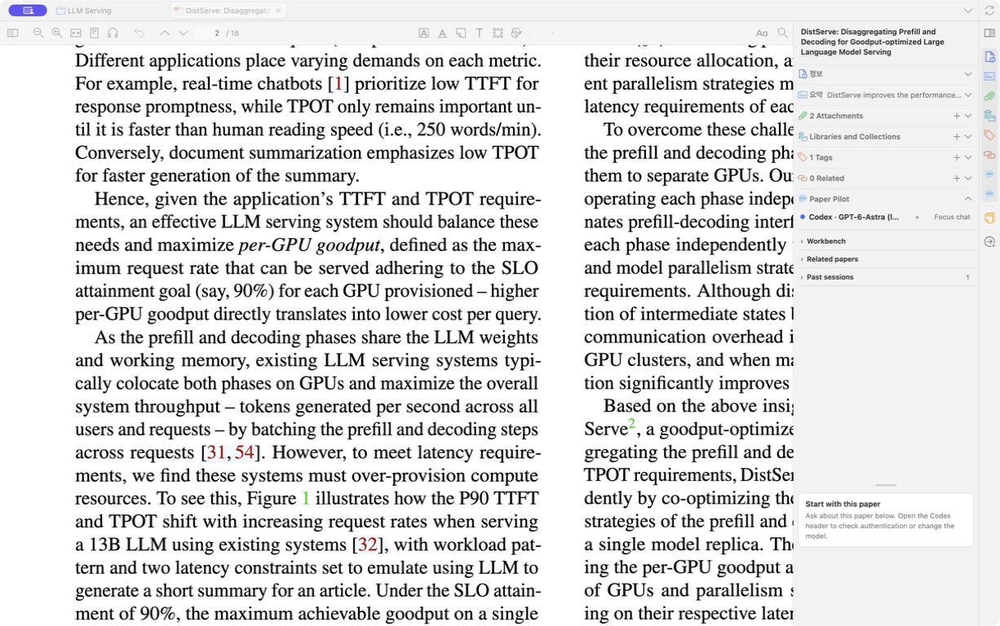
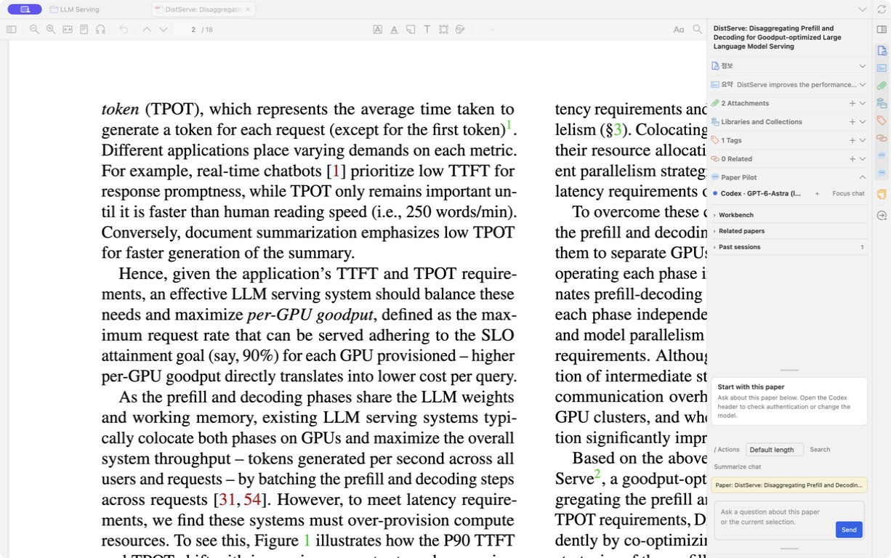
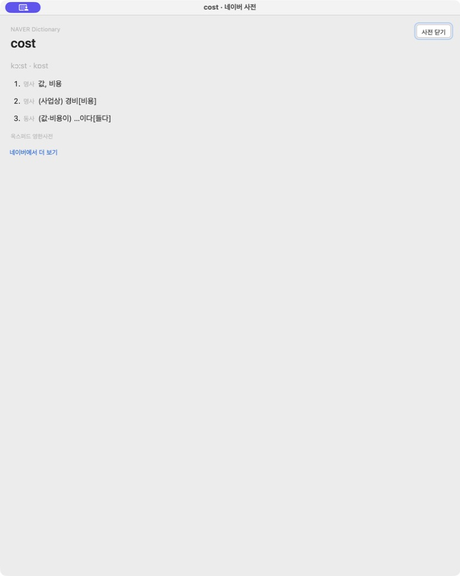

# Product review — 2026-09-21

This review follows the reader's main tasks: ask about a paper, inspect saved
conversations, return to a draft, follow a source, and look up a word. It also
checks persistence and cancellation paths that can undermine those tasks.

## Findings and changes

| Priority | User-visible failure                                                                                              | Change                                                                                                                                                               |
| -------- | ----------------------------------------------------------------------------------------------------------------- | -------------------------------------------------------------------------------------------------------------------------------------------------------------------- |
| High     | A delayed pin/save can overwrite a completed answer, undo a rename, or resurrect deleted history.                 | Serialize session mutations per paper and capture snapshots after queue admission. Failed writes do not poison later operations; separate papers remain independent. |
| High     | Returning from a saved search result loses a draft-only original conversation.                                    | Keep an in-memory return snapshot including the draft and attached context. Close search only after restoration succeeds.                                            |
| High     | Research Workspace evidence can open a page using an obsolete verification result.                                | Match the exact quote against the current, exact library/attachment before opening and derive current passage rectangles. Reject unavailable evidence.               |
| High     | Auto Highlight started in one reader can use a different paper selected in the main window.                       | Resolve the requested PDF first and use reader geometry only when that reader owns the resolved attachment.                                                          |
| Medium   | Default pane height ignores preceding Zotero sections and pushes the composer below a short viewport.             | Derive automatic height from the actual remaining space; preserve explicit manual resizing and allow overflow in constrained layouts.                                |
| Medium   | A late search failure replaces newer results; errors from old result navigation can reappear after search closes. | Bind success and failure rendering to the active search revision and component lifetime.                                                                             |
| Medium   | Escape fails while a command has focus, and Actions reports stale expanded state.                                 | Handle Escape throughout the command surface, restore composer focus, and synchronize expanded state.                                                                |
| Medium   | Auto Highlight preparation ignores cancellation/deadline until after a provider can start.                        | Forward both to workspace preparation and retain paper ownership until deferred cleanup confirms termination.                                                        |
| Medium   | The dictionary result is squeezed into the PDF selection toolbar.                                                 | Open a separate, modeless Zotero window with parsed headword, phonetics, meanings and source; reuse it for later lookups and cancel superseded requests.             |

The dictionary uses Naver's internal search response, which can change. It sends
the selected query only after activation, renders provider content as text,
limits response size and time, and has explicit no-match, error and retry states.
It neither starts an AI run nor stores dictionary results in conversation history.

## Review coverage

- Reader controls, chat search, commands, draft/context continuity and dictionary
  lifecycle: source review and targeted regression coverage, with native checks
  recorded separately below.
- Session persistence: controlled concurrent save, rename and deletion regressions;
  failure recovery and per-paper independence.
- Chat and Research Workspace evidence navigation: exact source identity,
  click-time quote verification and fresh geometry; no page-only fallback.
- Auto Highlight: preparation cancellation, deadlines, deferred cleanup and
  unconfirmed process termination.
- Provider/workspace/context code: bounded review of source binding, completion,
  cancellation and lifecycle ownership. No speculative provider refactor.
- Packaging and dependencies: production build and production dependency audit.

This is a focused review of the current implementation, not an assertion that
every provider, operating system, theme or Zotero version has been exercised.

## Verification

- 972 Node tests passed, with no failures or skips. Controlled persistence races
  failed against the previous implementation and pass with serialization.
- Product and test TypeScript checks and the production XPI build passed.
- Repository formatting and ESLint passed with zero errors and 122 existing
  warnings.
- Production dependency audit reported zero known vulnerabilities.
- Independent source reviews found no remaining blocker in the session queue,
  search restoration, evidence navigation or dictionary lifecycle.
- Native Zotero 10.0.3 on macOS: the narrow reader pane shows the composer and
  Send button; `cost` opens a separate dictionary window with phonetics, noun and
  verb meanings and source; Escape closes it. Saved-conversation search returns
  to the original unsent draft. Escape from a focused Actions command closes the
  menu and restores composer focus. A saved answer's verified citation opens
  PDF page 2; highlighting geometry was not visually verified in that check.

Early screenshots were blank and rejected. A restart restored capture. The
installed same-version XPI initially continued to execute stale code; archiving
the local startup cache while Zotero was stopped made the new code load. Native
screenshots subsequently confirmed dictionary content and the composer layout.
The repeatable runtime checklist remains in [manual-qa.md](manual-qa.md).

Not exercised: every AI provider end to end, Research Workspace's full project
flow, forced native network/termination failures, all themes, and Zotero 7–9.
Automated failure-path tests do not replace those runtime checks.

## Native screenshots

The same narrow reader pane before and after automatic height adjustment:

| Before: composer below the viewport                                  | After: composer and Send visible                                   |
| -------------------------------------------------------------------- | ------------------------------------------------------------------ |
|  |  |

The separate dictionary window displaying the live `cost` entry:

