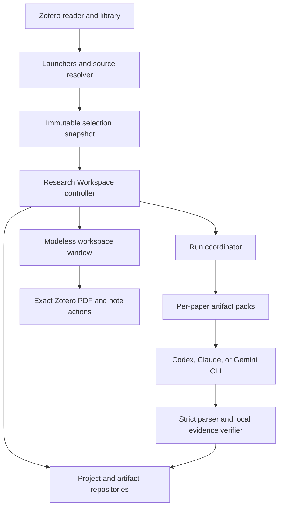

# Research Workspace redesign specification

Status: Proposed implementation specification
Last updated: 2026-08-30
Target: Paper Pilot for Zotero 7-10

## 1. Summary

Paper Pilot will keep one Zotero add-on, but Research Workspace will no longer
depend on the lifecycle of a Zotero item-pane section.

The add-on will provide two complementary surfaces:

1. The existing reader and item panes remain compact, single-paper surfaces for
   chat, local search, quick analysis, and opening evidence.
2. A persistent, modeless Research Workspace window becomes the primary surface
   for projects, multi-paper comparison, synthesis, artifact history, and
   cross-paper learning.

Zotero remains the source of truth for bibliographic items, PDF attachments,
annotations, notes, and collections. Paper Pilot becomes the source of truth for
analysis projects, research-set membership, evidence-backed artifacts, run
history, and derived-state freshness.

This is a redesign of product boundaries and persistence, not a second add-on,
hosted service, or independent companion application. The same XPI, local CLI
providers, extraction pipeline, and evidence-navigation integration remain in
use.

The first implementation priority is correctness. Before moving UI, Paper Pilot
must guarantee that the exact attachment selected or captured by a launcher is
the attachment extracted, indexed, cited, cached, and opened as evidence.

Implementation order:

| Priority | Outcome                                                                          |
| -------- | -------------------------------------------------------------------------------- |
| P0       | exact attachment, library-scoped identity, fingerprinting, and verified evidence |
| P0       | selection-independent modeless host and immutable selection capture              |
| P1       | named projects, artifact history, migration, and scoped export                   |
| P1       | checkpointed multi-paper execution and rich renderers                            |
| P1       | canonical Critical Read, Paper Mastery, and comparison engines                   |
| P2       | triage, living review, contradiction and gap analysis, and reference health      |

Related repository documents:

- architecture.md describes the currently implemented runtime;
- prompt-contracts.md describes currently implemented output contracts;
- manual-qa.md records real-Zotero verification; and
- this specification remains proposed until its delivery phases are implemented.

## 2. Status and normative language

This document describes proposed behavior. It must not be interpreted as
shipped functionality until the corresponding implementation and verification
are complete.

The terms MUST, MUST NOT, SHOULD, SHOULD NOT, and MAY are normative:

- MUST and MUST NOT are release requirements.
- SHOULD and SHOULD NOT are strong defaults that require a documented reason to
  violate.
- MAY describes optional behavior.

The implementation may be delivered in phases, but a phase must not claim
completion unless all acceptance criteria assigned to that phase pass.

## 3. Audit basis

This specification follows a source-level audit of the integrated Research
Workspace and the surrounding Paper Pilot runtime.

The important current facts are:

- src/modules/researchWorkspace/view.ts registers Research Workspace with
  Zotero.ItemPaneManager.registerSection.
- The multi-paper actions read the live Zotero selection only after the user
  clicks a button.
- Zotero replaces the ordinary single-item details surface when multiple
  library items are selected. Custom item-pane sections are therefore not a
  reliable host for multi-selection workflows.
- A single selection keeps the section visible but fails the two-paper minimum.
  A multi-selection satisfies the operation requirement but hides the section
  that contains the operation.
- Reader selection APIs represent the active reader paper, not an arbitrary
  library multi-selection.
- src/modules/researchWorkspace/paperSource.ts first resolves a selected
  attachment, but then calls paperWorkspaceContentCache.getPaperContent with
  the parent item.
- src/modules/tools/paperWorkspaceContent.ts independently chooses the first PDF
  attachment and caches by parent item ID. A paper with multiple PDFs can
  therefore be analyzed from one attachment while the returned evidence
  identity names another.
- persisted paper state is keyed by a bare Zotero item key, even though Zotero
  keys are scoped by library.
- multi-paper execution is bound to papers[0], and some operations serialize
  the full context of every selected paper into one request.
- the UI renders most structured results as JSON in a preformatted block.
- Research Workspace stores all papers and artifacts in one profile-global JSON
  document and exports the entire document rather than a selected project.
- the Reader Workbench and Research Workspace expose overlapping Critical Read,
  Paper Mastery, and comparison concepts through different engines and state.

The existing strengths must be preserved:

- one XPI with no hosted Paper Pilot server;
- local CLI provider selection through Codex CLI, Claude Code, or Gemini CLI;
- analysis runs isolated from visible chat sessions;
- strict structured-output parsers and fail-closed validation;
- atomic queued state writes;
- OpenDataLoader extraction with an honest Zotero text fallback;
- local hybrid search;
- evidence objects that can navigate back to Zotero;
- shared cancellation and detached-process termination infrastructure.

## 4. Problem statement

### 4.1 Multi-selection deadlock

The current feature has an unreachable state:

| Zotero state                | Research Workspace section                | Multi-paper operation                           |
| --------------------------- | ----------------------------------------- | ----------------------------------------------- |
| No selected paper           | unavailable                               | unavailable                                     |
| One selected paper          | visible                                   | rejected because fewer than two papers          |
| Two or more selected papers | hidden by the parent item-details surface | logically eligible but unreachable              |
| Reader tab                  | visible for the active paper              | cannot represent an arbitrary library selection |

Changing only the section's enabled flag cannot solve this problem because the
parent Zotero surface itself changes during multi-selection.

### 4.2 Incorrect source attribution risk

For a bibliographic item with PDF A and PDF B:

1. the user can select PDF B;
2. Research Workspace records PDF B as attachmentKey;
3. the shared content cache receives the parent item;
4. the shared extractor can choose PDF A as the first attachment; and
5. generated evidence can contain content from PDF A while navigation opens
   PDF B.

This violates Paper Pilot's core evidence-grounding contract. No UI redesign is
considered complete while this path remains possible.

### 4.3 Selection is being used as durable state

A transient UI selection currently determines both scope and execution. The
selection can change while extraction is running, disappear when a tab changes,
or become inaccessible when the pane is rebuilt.

A selection is an input event. It is not a project, identity, run owner, or
persistence key.

### 4.4 The workspace is not yet a workspace

The current section starts operations and displays their immediate JSON result.
It does not provide a durable project home, named research sets, artifact
history, scoped export, partial-run recovery, stale-state warnings, or rich
editing and review.

The redesign must make saved research state primary and execution buttons
secondary.

## 5. Settled product decisions

### 5.1 Keep the Zotero add-on

Paper Pilot MUST remain a Zotero add-on. The add-on is the best integration
point for:

- capturing selected items and attachments;
- resolving Zotero library identity;
- reading local PDFs and annotations;
- opening exact evidence locations;
- writing approved notes, tags, and collections;
- following Zotero lifecycle events; and
- using the user's configured local CLI provider.

The redesign MUST NOT require installing a second add-on.

### 5.2 Stop using Item Pane as the primary Research Workspace host

Item Pane MUST be limited to single-paper quick actions and summaries. It MUST
NOT contain the only entry point for a multi-paper operation.

### 5.3 Use a persistent modeless Zotero window

The primary Research Workspace surface MUST be a modeless window owned by Paper
Pilot. It must remain available when the Zotero selection changes and must be
focusable from every supported launcher.

The first delivery SHOULD use the existing zotero-plugin-toolkit DialogHelper
surface after validating its modeless behavior on Zotero 7-10.

A custom Zotero tab MAY be evaluated later behind a capability check. It is not
the initial host because its plugin-facing lifecycle and compatibility surface
are less stable across supported Zotero versions.

### 5.4 Do not build a standalone companion app in this delivery

A standalone application would require a new IPC protocol, separate lifecycle,
authentication and configuration duplication, Zotero synchronization, and
indirect evidence navigation. That cost is not justified for the current
problem.

An external client MAY be considered later only if long-running work must
continue after Zotero exits or if cross-application access becomes a product
requirement.

### 5.5 Make Project and Research Set first-class objects

A selection MAY create or extend a research set, but the durable scope is a
project ID. A project persists independently of current selection, tab, window,
and Zotero restart.

### 5.6 Preserve Zotero as the bibliographic source of truth

Paper Pilot MUST NOT duplicate or silently replace Zotero's bibliographic
database. It stores stable references to Zotero sources plus derived analysis
state.

### 5.7 Never silently omit or substitute a source

Every selected row MUST result in one of:

- accepted as a specific paper and attachment;
- skipped with a visible reason;
- retained as metadata-only with a visible limitation; or
- rejected because the operation cannot support it.

The current silent slice to twelve items and silent catch of unreadable items
MUST be removed from user-facing flows.

## 6. Goals

The redesign has the following goals:

- make zero-, one-, and multi-selection entry points reliable;
- keep the workspace visible and resumable after selection changes;
- guarantee exact attachment identity from capture through evidence navigation;
- model library-scoped source identity and content freshness;
- support durable named projects and temporary research sets;
- make multi-paper execution incremental, bounded, checkpointed, and resumable;
- verify model-proposed evidence locally before presenting it as navigable;
- render structured artifacts as task-specific interfaces rather than raw JSON;
- unify overlapping Paper Pilot capabilities behind one canonical engine per
  feature;
- make persistence, deletion, export, and Zotero writes explicit and scoped;
- preserve local-CLI provider independence and visible-chat isolation; and
- provide automated and real-Zotero tests for the failure modes that motivated
  the redesign.

## 7. Non-goals

The initial redesign does not:

- add a Paper Pilot hosted model API or server;
- upload PDFs, annotations, or notes to a new Paper Pilot service;
- replace Zotero collections or its library database;
- promise a universal scientific-quality or truth score;
- treat an LLM stance classification as proof that a claim is true or false;
- implement a full systematic-review platform in the first phase;
- add an unbounded autonomous agent that edits Zotero without confirmation;
- make external discovery mandatory for local analysis;
- guarantee that all provider CLIs have equal native JSON-schema capabilities;
- retain unlimited extraction indexes or artifacts forever by default; or
- remove legacy data before migration has been verified.

## 8. Design principles

### 8.1 Evidence before convenience

It is better to show an unverified or unavailable locator than to open the wrong
PDF or page.

### 8.2 Scope is explicit

Every operation declares whether it targets one source, a selection snapshot, or
a project. No operation infers durable scope from a later live selection.

### 8.3 Derived data carries lineage

Every artifact records the exact source fingerprints, operation version, parser
version, and model-run metadata that produced it.

### 8.4 Stale is a first-class state

When a source changes, old analysis remains available for comparison but MUST
not appear current.

### 8.5 Partial work is valuable

An Evidence Matrix with seven completed rows and one failed row is a recoverable
partial artifact, not a total failure.

### 8.6 Rendering does not cause persistence

Opening or rebuilding a pane or window MUST NOT register a paper, rewrite
workspace state, or invalidate a cache merely because UI rendered.

### 8.7 Local and remote boundaries remain visible

The UI distinguishes local extraction, local deterministic processing, local
CLI execution, and optional network discovery. It does not imply that every CLI
provider is an offline model.

### 8.8 Human approval precedes Zotero mutation

Generated notes, tags, collection changes, and metadata edits require preview
and confirmation. Reversible writes SHOULD offer undo.

## 9. Target runtime architecture



The modeless window is presentation. It does not own run state, project state,
or cancellation simply by having a DOM node.

The Research Workspace controller is the application boundary. Zotero-specific
selection and item resolution remain in an integration layer. Pure domain
contracts and parsers remain testable without Zotero globals.

## 10. Surface responsibilities

### 10.1 Reader and item pane

The existing pane SHOULD expose only active-paper actions that fit a narrow
surface:

- ask about the active paper or selected passage;
- local hybrid search;
- show recent or pinned evidence;
- open or resume the canonical Critical Read;
- open or resume the canonical Paper Mastery;
- run a quick single-paper artifact such as Reproducibility or Paper-to-Code;
- add the paper to an existing project; and
- open the full Research Workspace focused on this paper.

The pane MUST NOT contain the only controls for Evidence Matrix, relationship
graph, cross-paper mastery, project export, or project-wide question answering.

### 10.2 Research Workspace window

The modeless window owns:

- project creation, naming, opening, archiving, and deletion;
- paper membership and review status;
- multi-paper operations;
- persistent artifact browsing and version history;
- partial-run progress and resume;
- source freshness and stale-state repair;
- project-scoped search and question answering;
- rich Evidence Matrix and graph rendering;
- export and approved Zotero writes; and
- project-level settings and privacy information.

### 10.3 Launchers

Paper Pilot MUST register:

- a library-item context-menu command;
- a global Tools-menu command; and
- MAY register a toolbar button if the supported Zotero version provides a
  stable integration point.

Recommended labels:

- Open Research Workspace
- Open paper in Paper Pilot
- Compare selected papers in Paper Pilot
- Add selected papers to Paper Pilot project

Launchers MUST be registered per Zotero main window during main-window load and
removed during window unload or add-on shutdown.

## 11. Selection capture contract

### 11.1 Capture timing

The launcher MUST capture the current selection before opening or focusing the
workspace. Later work MUST use that immutable snapshot.

An operation MUST NOT call getSelectedItems at execution time to rediscover its
scope.

### 11.2 Snapshot shape

```ts
interface SelectionSnapshot {
  snapshotID: string;
  capturedAt: string;
  origin:
    | "library-context-menu"
    | "tools-menu"
    | "reader-pane"
    | "item-pane"
    | "workspace-add";
  sourceCandidates: SourceCandidate[];
  acceptedSourceIDs: string[];
  skipped: SelectionSkip[];
  zoteroWindowID?: string;
}

interface SourceCandidate {
  itemID: number;
  libraryID: number;
  itemKey: string;
  title: string;
  selectedKind: "bibliographic-item" | "pdf-attachment" | "other";
  selectedAttachmentKey?: string;
  resolvedSourceID?: SourceID;
}

interface SelectionSkip {
  itemID?: number;
  itemKey?: string;
  title: string;
  reason:
    | "duplicate"
    | "no-pdf"
    | "unsupported-attachment"
    | "missing-file"
    | "unreadable"
    | "selection-limit"
    | "resolution-error";
  detail?: string;
}
```

The snapshot is a launch input and audit record. It does not contain full PDF
text.

Candidates are deduplicated by resolved SourceID, not bare item key. If the same
paper is represented by both its parent item and an explicitly selected child
PDF, the explicit child attachment binding wins and the parent candidate is
reported as a duplicate.

### 11.3 Zero selected items

Open Research Workspace from the Tools menu MUST open or focus the workspace
home. The user can:

- open a recent project;
- create an empty project;
- view due Paper Mastery reviews; or
- add papers later.

Zero selection is valid and MUST NOT show a generic no-paper error.

### 11.4 One selected item

The workspace opens a paper-detail context. The user can:

- inspect existing artifacts;
- add the paper to a new or existing project;
- run a single-paper operation; or
- choose a specific PDF if the item has multiple attachments.

Selecting a child PDF MUST preserve that exact attachment. Selecting a parent
item with multiple eligible PDFs MUST use an explicit deterministic policy:

1. reuse the project's already bound attachment when one exists;
2. otherwise use Zotero's primary or best attachment only if the API identifies
   it unambiguously; or
3. ask the user to choose.

Paper Pilot MUST NOT silently choose the first PDF when more than one plausible
attachment exists.

### 11.5 Two or more selected items

The workspace opens a selection-review screen before starting analysis. It
shows:

- selected count;
- accepted paper and attachment count;
- duplicate count;
- skipped items and reasons;
- extraction readiness;
- whether the set will create a temporary research set, create a named project,
  or be added to an existing project; and
- the operation presets available for the accepted set.

No model run begins merely because the window opened.

### 11.6 Large selections

Project membership MAY exceed the first interactive operation limit. Paper
Pilot MUST NOT silently truncate a selection.

For the first delivery:

- a direct comparison run MAY limit one batch to twelve papers;
- all selected items still appear in the review screen;
- excess papers can be added to the project and processed in explicit batches;
  and
- the UI explains which papers are in the current batch.

Later phases SHOULD replace the fixed operation cap with a budgeted incremental
pipeline.

## 12. Window lifecycle

### 12.1 Instance policy

Paper Pilot SHOULD keep one Research Workspace window per add-on process. A
launcher focuses the existing window and offers the newly captured snapshot to
its controller.

If a different project has unsaved user edits, the controller MUST NOT replace
the active view silently. It offers:

- add the new selection to the current project;
- open it as a temporary research set;
- create another project; or
- cancel.

### 12.2 DOM-independent state

Closing, hiding, or rebuilding the window DOM MUST NOT erase:

- the active project;
- completed artifacts;
- a persisted partial artifact;
- a run owner;
- a cancellation token; or
- the last terminal result.

Run state belongs to addon.data and the run repository, not to a WeakMap keyed
only by a rendered root element.

### 12.3 Closing while a run is active

Closing a window with an active run MUST show a clear choice:

- Keep running and close; or
- Cancel run and close.

If Keep running is not implemented in the first host phase, the only allowed
fallback is an explicit confirmation that closing will cancel. Silent orphaning
and silent cancellation are both forbidden.

Add-on shutdown MUST attempt bounded process-tree termination for all active
Research Workspace runs and preserve an interrupted checkpoint when safe.

### 12.4 Registration and cleanup

The implementation MUST:

- register menus for every existing and newly opened Zotero main window;
- remove them for a closed main window;
- focus rather than duplicate an existing workspace window;
- close or detach the window safely during add-on shutdown;
- abort only operations owned by the relevant run when cancellation is chosen;
- release every reservation exactly once; and
- check and log registration failures instead of setting an unconditional
  registered flag.

The current async ItemPane render hook must be moved to the supported async
render lifecycle where applicable, and each retained pane section must implement
destruction cleanup.

## 13. Information architecture

The initial workspace SHOULD use a three-region layout:

| Region        | Purpose                                                             |
| ------------- | ------------------------------------------------------------------- |
| Left sidebar  | Projects, paper list, review state, stale and missing-source badges |
| Top scope bar | Project name, active scope, engine, run status, add-papers action   |
| Main content  | Current project mode or selected artifact                           |

The main project modes are:

1. Overview
2. Papers
3. Evidence
4. Matrix
5. Graph
6. Synthesis
7. Mastery
8. Artifacts

Not every mode must ship in the first visual phase. The navigation contract
should remain stable so later modes do not recreate project identity.

### 13.1 Overview

Overview shows:

- research question;
- optional PICO or domain-specific scope;
- inclusion and exclusion criteria;
- paper counts by review state;
- missing or changed sources;
- recent artifacts and runs;
- incomplete work; and
- suggested next actions.

### 13.2 Papers

Papers provides:

- sortable membership list;
- role and review status;
- PDF and extraction readiness;
- source fingerprint state;
- include, exclude, and exclusion reason;
- user notes;
- last analyzed time; and
- per-paper artifact shortcuts.

Recommended review states are:

- unreviewed;
- maybe;
- up-next;
- skimmed;
- read;
- understood;
- included; and
- excluded with a required reason.

These statuses are user workflow metadata. They are not model judgments unless
the UI labels a suggestion and the user accepts it.

### 13.3 Evidence

Evidence presents the Claim-Evidence Ledger as structured cards or a table. It
must distinguish:

- paper claim;
- exact source evidence;
- reader note;
- agent inference;
- external publication evidence; and
- verification state.

### 13.4 Matrix

Matrix renders paper rows and question columns. It supports:

- column creation and editing;
- per-cell evidence;
- per-cell verification state;
- per-row and per-cell regeneration;
- user approval or correction;
- partial progress;
- filters; and
- CSV and Markdown export.

### 13.5 Graph

Graph must distinguish graph semantics:

- verified citation edge;
- shared-reference edge;
- author or metadata relationship;
- text-inferred agreement, contradiction, extension, or method reuse; and
- unknown or unverified relationship.

The current Literature Graph MUST be labelled Relationship Graph until citation
edges are verified from bibliographic or reference data. An LLM-inferred edge
must never be presented as a verified citation.

### 13.6 Synthesis

Synthesis provides project-level questions and reports. By default, answers use
accepted, non-stale, locally verified evidence. The user may opt to include
unverified evidence, but the result must retain coverage warnings.

### 13.7 Artifacts

Artifacts provides:

- type, version, creation time, and source scope;
- complete, partial, failed, stale, and superseded states;
- input and model-run lineage;
- open, duplicate, rename, export, compare, and delete actions; and
- a repair or rerun action for stale artifacts.

## 14. Required UI states

Every major mode MUST define:

- initial empty state;
- metadata-loading state;
- extraction-required state;
- queued, preparing, running, and cancelling states;
- partial state;
- success state;
- stale state;
- missing-source state;
- recoverable validation error;
- provider configuration or login error;
- timeout;
- stop-not-confirmed error; and
- unexpected storage error.

Raw stderr is diagnostic data. It may appear under a collapsed Raw logs
disclosure, but user-facing errors MUST use the shared safe failure
classification.

The UI MUST preserve the last valid artifact when refresh or rerun fails.

## 15. Source identity contract

### 15.1 Canonical identity

A source is uniquely identified by Zotero library, bibliographic item, and
attachment:

```ts
interface ZoteroSourceIdentity {
  libraryID: number;
  itemKey: string;
  attachmentKey: string;
  standaloneAttachment: boolean;
}

type SourceID = string;
```

SourceID MUST be deterministically derived from the canonical tuple. A readable
canonical form may be zotero:{libraryID}:{itemKey}:{attachmentKey}. If a digest
is used for file names, the canonical tuple must still be persisted.

Numeric itemID and attachmentID are runtime handles. They MAY be cached but MUST
NOT be the only durable identity because they are profile-local and less stable
than library-scoped keys.

For a child PDF, itemKey is its parent bibliographic item key. For a standalone
PDF attachment, itemKey equals attachmentKey and standaloneAttachment is true.
This rule keeps standalone attachments addressable without inventing a parent.

### 15.2 Attachment binding

All source-loading APIs MUST accept the exact resolved attachment:

```ts
interface ResolvedPaperSource {
  sourceID: SourceID;
  libraryID: number;
  itemKey: string;
  attachmentKey: string;
  itemID: number;
  attachmentID: number;
  title: string;
  filePath?: string;
}
```

The content extractor MUST receive attachmentID or the attachment object. It
must not resolve another attachment from the parent item.

The extraction result MUST echo the same SourceID and attachmentKey. A mismatch
is a hard failure and MUST NOT enter caches or artifact state.

### 15.3 Content fingerprint

Each source record stores a content fingerprint:

```ts
interface ContentFingerprint {
  algorithm: "sha256" | "zotero-version-mtime-size-v1";
  value: string;
  fileSize?: number;
  modifiedTime?: number;
  zoteroVersion?: number;
}

interface ExtractionFingerprint {
  contentFingerprint: ContentFingerprint;
  extractor: "opendataloader-pdf" | "zotero-attachment-text";
  extractorVersion: string;
  extractionOptionsVersion: string;
}
```

SHA-256 of local PDF bytes is preferred when its cost is acceptable. A bounded
metadata fingerprint MAY be used for quick checks, but a suspicious change must
invalidate derived state conservatively.

The current max-character truncation is not a source fingerprint. Artifact
lineage must identify both the full source fingerprint and the bounded context
projection used by a run.

### 15.4 Cache key

Extraction and hybrid-index caches MUST be keyed by:

- SourceID;
- content fingerprint;
- extractor version; and
- relevant chunking or indexing configuration version.

A parent item ID alone is forbidden as a content-cache key.

Caches MUST support bounded LRU eviction. Opening many papers must not retain
unlimited full contexts in a process-global Map.

## 16. Project and research-set model

```ts
interface Criterion {
  criterionID: string;
  text: string;
  enabled: boolean;
  createdBy: "user" | "suggested";
  acceptedAt?: string;
}

interface ResearchProject {
  projectID: string;
  name: string;
  description?: string;
  researchQuestion?: string;
  scope?: {
    pico?: {
      population?: string;
      intervention?: string;
      comparison?: string;
      outcome?: string;
    };
    inclusionCriteria: Criterion[];
    exclusionCriteria: Criterion[];
  };
  members: ProjectMember[];
  defaultEngineMode?: "codex_cli" | "claude_code" | "gemini_cli";
  activeArtifactID?: string;
  createdAt: string;
  updatedAt: string;
  archivedAt?: string;
}

interface ProjectMember {
  sourceID: SourceID;
  role: "seed" | "candidate" | "background" | "comparison" | "included";
  reviewStatus:
    | "unreviewed"
    | "maybe"
    | "up-next"
    | "skimmed"
    | "read"
    | "understood"
    | "included"
    | "excluded";
  exclusionReason?: string;
  addedAt: string;
  updatedAt: string;
  userNote?: string;
}
```

An excluded member MUST have an exclusion reason before a systematic-review
export can claim a reproducible exclusion log.

A temporary research set is an unsaved project draft. It receives a stable
temporary ID immediately so runs and artifacts do not depend on selection. The
user can name and save it later.

Project membership and Zotero collection membership are related but not
identical. Optional synchronization MUST be explicit and conflict-aware.

## 17. Source record

```ts
interface SourceRecord {
  sourceID: SourceID;
  identity: ZoteroSourceIdentity;
  title: string;
  creators?: string[];
  year?: number;
  doi?: string;
  runtimeItemID?: number;
  runtimeAttachmentID?: number;
  contentFingerprint?: ContentFingerprint;
  extractionFingerprint?: ExtractionFingerprint;
  extractionQuality: "structured" | "zotero_text" | "unavailable";
  extractionNotes: string[];
  availability: "ready" | "missing-file" | "unreadable" | "detached";
  lastResolvedAt: string;
  lastExtractedAt?: string;
}
```

Source resolution SHOULD refresh runtime IDs from libraryID and keys on startup
or demand. A missing item remains represented as detached so its historical
artifacts can be inspected.

## 18. Artifact, lineage, and freshness model

### 18.1 Artifact envelope

```ts
interface ResearchArtifact<T = unknown> {
  artifactID: string;
  projectID: string;
  type:
    | "claim-ledger"
    | "critical-read"
    | "methodology-audit"
    | "paper-mastery"
    | "reproducibility"
    | "paper-to-code"
    | "evidence-matrix"
    | "relationship-graph"
    | "cross-paper-mastery"
    | "citation-stance"
    | "synthesis"
    | "review-log";
  title: string;
  version: number;
  status: "draft" | "partial" | "complete" | "failed" | "stale" | "superseded";
  sourceIDs: SourceID[];
  lineage: ArtifactLineage;
  payload: T;
  createdAt: string;
  updatedAt: string;
  completedAt?: string;
  supersedesArtifactID?: string;
}
```

### 18.2 Lineage

```ts
interface ArtifactLineage {
  inputs: Array<{
    sourceID: SourceID;
    contentFingerprint: string;
    contextProjectionFingerprint: string;
  }>;
  operation: string;
  operationVersion: string;
  promptVersion: string;
  parserVersion: string;
  schemaVersion?: string;
  evidenceVerifierVersion: string;
  providerMode: "codex_cli" | "claude_code" | "gemini_cli";
  model?: string;
  runID: string;
}
```

Provider resume IDs, raw commands, and local absolute paths MUST NOT be exported
as scientific provenance. They may be retained separately for local diagnostics
when privacy settings allow.

### 18.3 Freshness rules

An artifact becomes stale when any of the following changes:

- a required source content fingerprint;
- the attachment bound to a source;
- an extraction result required by the artifact;
- an operation, prompt, parser, or evidence-verifier version declared
  freshness-sensitive; or
- a user-approved matrix cell or project criterion on which it depends.

The artifact remains readable. The UI shows:

- what changed;
- which outputs are affected;
- when the artifact was last current; and
- rerun or repair options.

Paper Pilot MUST NOT silently mutate an old artifact into a new version. A rerun
creates a new version and marks the prior one superseded when appropriate.

### 18.4 Partial artifacts

Checkpointable artifacts record progress:

```ts
interface ArtifactCheckpoint {
  completedUnits: string[];
  failedUnits: Array<{ unitID: string; message: string }>;
  pendingUnits: string[];
  lastCheckpointAt: string;
}
```

An Evidence Matrix unit is normally one paper row or one explicitly regenerated
cell. A multi-paper extraction failure MUST preserve already completed units.

## 19. Evidence contract

### 19.1 Evidence reference

All new Research Workspace artifacts MUST use a library-scoped evidence
reference:

```ts
interface EvidenceReferenceV2 {
  sourceID: SourceID;
  libraryID: number;
  attachmentKey: string;
  pageIndex?: number;
  pageLabel?: string;
  sectionPath?: string[];
  elementID?: string;
  elementType?:
    | "paragraph"
    | "figure"
    | "table"
    | "equation"
    | "footnote"
    | "appendix"
    | "other";
  exactQuote?: string;
  boundingBoxes?: Array<{
    pageIndex: number;
    rect: [number, number, number, number];
  }>;
  verification: {
    status: "verified" | "unverified" | "not-found" | "source-unavailable";
    method:
      | "pdf-exact-quote"
      | "structured-element"
      | "zotero-annotation"
      | "metadata-only"
      | "none";
    verifiedAt?: string;
    verifierVersion: string;
    detail?: string;
  };
}
```

### 19.2 Local verification

Model output is a candidate locator, not a verified locator.

Before persistence as verified evidence, Paper Pilot MUST:

1. resolve SourceID to the exact library and attachment;
2. reject an attachment key outside the run's admitted source set;
3. validate pageIndex against the PDF page count when available;
4. normalize and match exactQuote against local PDF text or a structured
   OpenDataLoader element;
5. derive bounding boxes only from local text geometry or trusted structured
   extraction;
6. record the verification method and version; and
7. downgrade rather than fabricate when matching is uncertain.

The existing autoHighlight PDF matching pipeline SHOULD be reused and promoted
to a shared evidence-verification module. Research Workspace must not implement
a looser second quote matcher.

### 19.3 Verification outcomes

- verified evidence is navigable and may display a verified badge;
- unverified evidence may display its quote and claimed section but must be
  clearly labelled;
- not-found evidence retains diagnostic context for repair but must not show a
  misleading Open in PDF action; and
- source-unavailable evidence remains inspectable in historical artifacts.

Verification describes locator matching. It does not prove that the cited text
supports the artifact's scientific conclusion.

### 19.4 Evidence navigation

Opening evidence MUST resolve by libraryID and attachmentKey. Scanning every
library for the first matching bare attachment key is forbidden.

Navigation SHOULD:

- open the exact attachment;
- navigate to pageIndex;
- apply a temporary non-persistent highlight when verified bounding boxes are
  available;
- focus an existing reader tab when safe; and
- report a stale or missing source without substituting another PDF.

## 20. Persistence architecture

### 20.1 Storage goals

The new repository must:

- avoid rewriting every project and artifact for one small change;
- preserve atomicity;
- support partial artifacts and run checkpoints;
- make project-scoped export and deletion possible;
- support idempotent migration;
- remain inspectable and recoverable without a Paper Pilot server; and
- avoid writing full paper text into durable project state unless a user
  explicitly enables a local cache.

### 20.2 Target directory layout

The target layout under the existing Zotero profile directory is:

```text
paperpilot-research-workspace/
  catalog-v1.json
  migration/
    v4-import.json
  projects/
    project-{projectID}/
      project.json
      members.json
      artifacts/
        artifact-{artifactID}.json
      runs/
        run-{runID}.json
  sources/
    source-{sourcePathID}.json
  cache/
    extraction/
    hybrid-index/
  exports/
```

sourcePathID is a safe digest of the canonical SourceID. The canonical
library/item/attachment tuple remains inside the source record.

The cache directory is derived and prunable. Project, source metadata, artifact,
and migration files are durable.

### 20.3 Catalog

catalog-v1.json contains only the information required to list and open
projects:

```ts
interface ResearchWorkspaceCatalog {
  schemaVersion: 1;
  revision: number;
  projects: Array<{
    projectID: string;
    name: string;
    updatedAt: string;
    archivedAt?: string;
    memberCount: number;
    staleArtifactCount: number;
  }>;
  createdAt: string;
  updatedAt: string;
}
```

The catalog MUST NOT embed every artifact payload.

### 20.4 Atomicity and concurrency

Every durable file write MUST use temporary-file plus atomic move when Zotero's
runtime supports it.

Repositories MUST serialize writes per target file. Project and artifact files
carry revision numbers. A stale writer must fail with a revision conflict rather
than silently overwrite a newer edit from another window.

Creating or updating an artifact follows this order:

1. write and fsync or atomically move the artifact or checkpoint;
2. update the project reference if required; and
3. update the lightweight catalog last.

If step 3 fails, the project remains discoverable through a repair scan. The
catalog is an index, not the only copy of project identity.

### 20.5 Persistence policy

Opening a paper, pane, or workspace window MUST NOT write state.

Writes occur only for explicit events:

- create or edit a project;
- add or remove a member;
- change a review decision or note;
- start, checkpoint, complete, cancel, or fail a persisted run;
- create, update, supersede, or delete an artifact;
- change a Research Workspace preference; or
- complete a migration or repair.

### 20.6 Retention

Users MUST be able to:

- delete an artifact;
- delete or archive a project;
- prune extraction and index caches;
- inspect storage use;
- choose whether raw local run logs are retained; and
- choose a bounded artifact-history policy.

Deleting a project MUST show what will be removed and whether Zotero notes or
collections created from it remain. Zotero objects must not be deleted
implicitly with a Paper Pilot project.

## 21. Migration from current workspace state

### 21.1 Source

The current source is:

paperpilot-research-workspace/workspace-v3.json

Its internal schema version is currently 4. The historical file name must not be
used to infer its schema version.

### 21.2 Safety rules

Migration MUST be:

- idempotent;
- non-destructive;
- restartable;
- guarded against a newer unsupported schema;
- atomic at the new catalog boundary; and
- accompanied by a visible migration summary.

Paper Pilot MUST preserve the original file until the user explicitly removes
it after successful validation.

Before import, Paper Pilot SHOULD create a timestamped backup or record the
original content fingerprint and exact path.

### 21.3 Import mapping

The importer creates one project named Imported Research Workspace unless the
user chooses another name.

Legacy data maps as follows:

| Legacy state                    | New state                                                   |
| ------------------------------- | ----------------------------------------------------------- |
| papers map                      | source records and project members                          |
| claimLedger                     | claim-ledger artifact                                       |
| criticalReads                   | methodology-audit artifact with legacy provenance           |
| reproducibilityReports          | reproducibility artifacts                                   |
| paperToCodeReports              | paper-to-code artifacts                                     |
| mastery                         | paper-mastery artifact or canonical mastery migration input |
| matrices                        | evidence-matrix artifacts                                   |
| graphs                          | relationship-graph artifacts                                |
| crossPaperMastery and questions | cross-paper-mastery artifacts                               |
| citation contexts and results   | citation-stance artifacts                                   |
| preferences                     | supported new preferences only                              |

### 21.4 Resolving legacy identity

Legacy paperKey and attachmentKey do not include libraryID.

For each legacy record, the importer:

1. searches Zotero libraries for a matching item and attachment pair;
2. accepts automatic binding only if the pair is unique;
3. records unresolved or ambiguous records as detached legacy sources;
4. asks the user to repair ambiguous sources before rerunning them; and
5. never binds to the first matching key silently.

### 21.5 Legacy freshness

Legacy artifacts lack complete content, prompt, parser, and verifier
fingerprints. They MUST be imported as one of:

- stale with reason legacy-lineage-incomplete; or
- legacy-unverified when their evidence contract cannot be validated.

They remain readable and exportable. They cannot appear as current verified
artifacts until repaired or rerun.

### 21.6 Commit marker

migration/v4-import.json records:

- legacy path and content fingerprint;
- importer version;
- start and completion timestamps;
- created project ID;
- counts of migrated, skipped, detached, and ambiguous sources;
- artifact counts by type; and
- warnings.

A matching completed marker prevents duplicate import.

## 22. Run ownership and lifecycle

### 22.1 Run owner

Research Workspace runs require an owner independent of a first paper:

```ts
type WorkspaceRunOwner =
  | { kind: "paper"; itemID: number; sourceID: SourceID }
  | { kind: "project"; projectID: string };
```

The shared run-admission layer SHOULD be generalized to accept this owner. A
project run MUST NOT use papers[0] as its durable reservation identity.

During a transitional phase, the current item-scoped engine selection MAY be
resolved from an admitted source, but run state, checkpoints, and artifact
lineage must already use runID and projectID.

### 22.2 Run record

```ts
interface ResearchWorkspaceRun {
  runID: string;
  owner: WorkspaceRunOwner;
  projectID?: string;
  operation: string;
  operationVersion: string;
  sourceSnapshot: Array<{
    sourceID: SourceID;
    contentFingerprint: string;
  }>;
  status:
    | "queued"
    | "preparing"
    | "running"
    | "cancelling"
    | "partial"
    | "completed"
    | "failed"
    | "cancelled"
    | "interrupted";
  progress: {
    phase: string;
    completed: number;
    total?: number;
    currentUnit?: string;
  };
  artifactID?: string;
  safeError?: string;
  startedAt?: string;
  updatedAt: string;
  completedAt?: string;
}
```

Process IDs and local workspace paths belong in private runtime state, not the
portable artifact.

### 22.3 Shared lifecycle

Research Workspace MUST reuse the shared:

- run admission and reservation semantics;
- progress presentation;
- cancellation and process-tree termination;
- timeout ownership;
- failure classification;
- retry policy;
- raw-log disclosure; and
- cleanup ordering.

The current four-minute custom polling loop in analysisRunner.ts SHOULD be
replaced with the common lifecycle or reduced to a thin adapter. Research
Workspace must not maintain a second incompatible run-state machine.

### 22.4 Structured output

Every structured operation MUST declare a schema next to its prompt and parser.
The facade or run coordinator MUST pass outputSchema to the shared runner.

Native CLI schema flags are an additional guard. Local parsers remain
authoritative and required.

One bounded repair attempt MAY be used. Repair prompts must serialize validation
errors and previous output as untrusted data.

### 22.5 Stable project workspace

A project operation builds a temporary run workspace:

```text
PROJECT_INDEX.md
project.json
operation.json
papers/
  source-{sourcePathID}/
    metadata.json
    paper.md
    extraction.json
    claim-card.json
    retrieval.json
prior-artifacts/
output-schema.json
```

PROJECT_INDEX.md defines the required reading order and explicitly identifies
source boundaries.

A file is dead weight unless the applicable provider prompt tells the agent to
read it. Workspace builders and prompts must change together.

### 22.6 Context budget

Multi-paper operations MUST use one total context budget, not max characters
multiplied by paper count.

The context planner:

1. reserves a minimum metadata and claim-card budget per admitted source;
2. allocates remaining budget by operation relevance;
3. retrieves bounded chunks for each question or matrix column;
4. records included and omitted context projections;
5. never silently drops an entire admitted paper; and
6. reports insufficient coverage before synthesis.

Full extracted text may remain locally available in separate files, but prompts
must not instruct an agent to read every full paper when the operation budget
selects bounded projections.

Context projection selection MUST be deterministic for the same inputs,
operation version, and budget.

### 22.7 Checkpointing and resume

Long operations checkpoint after each independently valid unit.

Resume MUST verify:

- project ID;
- operation version;
- source fingerprint snapshot;
- completed-unit payload validity; and
- current parser and schema compatibility.

If one source changed, unaffected completed units MAY be reused while dependent
units become pending or stale.

### 22.8 Cancellation

Cancellation:

- belongs to runID;
- stops only the owned process tree;
- prevents late callbacks from updating a newer run;
- checkpoints completed valid units before terminal cancellation when safe;
- releases the owner exactly once; and
- retains ownership when process termination cannot be confirmed.

## 23. Feature contracts

### 23.1 Local hybrid search

Local search remains deterministic and does not launch an AI CLI.

It MUST:

- search an exact SourceID;
- key its index by extraction fingerprint;
- evict indexes through a bounded LRU;
- return library-scoped evidence;
- verify source availability before navigation; and
- avoid rewriting project state for a search.

Project search MAY federate per-paper indexes. Results show paper title, section,
page, matched terms, and extraction quality.

### 23.2 Claim-Evidence Ledger

Claim extraction creates a versioned claim-ledger artifact.

Each claim contains:

- normalized claim text;
- claim type;
- paper-reported or agent-inferred origin;
- one or more EvidenceReferenceV2 objects;
- locator verification status;
- limitations or uncertainty;
- user review state; and
- dependency on a source fingerprint.

A claim without matched evidence may be retained as agent inference but MUST NOT
be labelled paper-supported.

### 23.3 Canonical Critical Read

The seven-step reader-first workflow in src/modules/criticalRead is the
canonical Critical Read.

Research Workspace displays and resumes its artifact but MUST NOT create a
second workflow also named Critical Read.

The profiled audit currently under
researchWorkspace/core/criticalRead/profiled should become one of:

- a Methodology Audit artifact integrated with the canonical Critical Read
  method step; or
- an internal profile detector reused by that step.

Its user-visible label MUST NOT remain Profiled Critical Read once both surfaces
are available.

### 23.4 Reproducibility

Reproducibility remains a single-paper artifact and SHOULD be available from
both the quick pane and project artifact menu.

It distinguishes:

- explicitly reported resources and procedures;
- inferred implementation requirements;
- missing information;
- environment-specific assumptions; and
- a readiness summary that is not a guarantee of successful reproduction.

### 23.5 Paper-to-Code

Paper-to-Code produces an implementation map, not generated code by default.

It SHOULD connect:

- paper component;
- evidence;
- proposed software module;
- input and output contract;
- uncertainty;
- validation test; and
- dependency order.

Any future repository-writing action is a separate approved workflow and is
outside this initial redesign.

### 23.6 Evidence Matrix

Evidence Matrix is the primary multi-paper comparison artifact.

Required behavior:

- columns are versioned project configuration;
- rows are keyed by SourceID;
- each cell records value, evidence, verification, user edit, and freshness;
- each paper row is persisted immediately after validation;
- a failed row does not discard completed rows;
- the user can retry a row or regenerate one cell;
- a user edit is preserved on unrelated reruns;
- changing a column invalidates only dependent cells;
- coverage reports papers, required cells, extracted cells, verified cells, and
  missing cells separately; and
- export includes source identity and evidence locators.

Quick Compare is a two-paper preset of Evidence Matrix. It MUST NOT maintain a
separate comparison prompt and persistence engine.

### 23.7 Relationship and citation graph

Graph nodes are project sources or explicitly admitted external papers.

Every edge contains:

- source and target IDs;
- edge type;
- direction;
- evidence or bibliographic provenance;
- verification state;
- confidence only when meaningful;
- operation version; and
- user review state.

Verified citation edges require local references, Zotero relations, or admitted
bibliographic metadata. Text-inferred edges are labelled inferred.

Graph validation MUST reject:

- unknown project source IDs;
- self-edges unless an edge type explicitly permits them;
- unsupported attachment keys;
- duplicate incompatible edges;
- invalid direction; and
- an edge labelled verified without qualifying provenance.

### 23.8 Project question answering and synthesis

Project Q&A answers from an immutable artifact and source snapshot.

The default answer contract contains:

- concise answer;
- claims with evidence references;
- agreements and contradictions;
- coverage and excluded-source summary;
- unresolved uncertainty; and
- source freshness warning.

The answer MUST fail closed or narrow its claim when accepted verified evidence
is insufficient. It must not present a bibliography as if every paper was
fully analyzed.

### 23.9 Paper Mastery

Paper Pilot must have one canonical Paper Mastery engine.

The recommended consolidation is:

- keep the existing Reader Workbench entry point and session-history
  integration;
- adopt the stronger criterion scoring, calibration, and review scheduling from
  Research Workspace Mastery 2.0;
- place the canonical implementation under src/modules/comprehensionCheck; and
- migrate or expose legacy v2 state through a compatibility adapter.

The full workspace shows:

- active question;
- source scope;
- learner answer and confidence;
- rubric scores;
- misconceptions;
- calibration;
- next review time; and
- history across a paper or project.

Cross-paper mastery uses the same scoring and scheduling contracts with a
project source set. A session ID and source snapshot must persist so it can be
resumed after a window rebuild or Zotero restart.

### 23.10 Citation stance

The manual JSON-array textarea is not a product interface and MUST be removed
from the primary UI.

The feature SHOULD:

1. extract citation contexts from a selected PDF or accepted project sources;
2. resolve cited works against Zotero and identifiers when possible;
3. show the exact citing sentence and local page;
4. classify a context as supporting, contrasting, mentioning, background, or
   uncertain;
5. preserve classifier confidence and limitations;
6. allow correction; and
7. report coverage when only abstracts or local PDFs are available.

Stance classification is a review signal. It is not a truth verdict.

### 23.11 Export

Export is scoped to the active project or selected artifact.

Supported initial formats SHOULD include:

- project JSON with portable lineage and no absolute paths;
- Markdown report;
- Evidence Matrix CSV;
- graph Mermaid or JSON;
- review decision log;
- Zotero note preview; and
- a manifest of source identities and fingerprints.

Export MUST NOT include unrelated profile-global projects.

After file export, the UI shows the destination and offers Reveal or Open when
supported.

### 23.12 Zotero notes

Saving to a Zotero note requires:

- destination paper or collection;
- preview;
- evidence and freshness summary;
- user confirmation; and
- a stable Paper Pilot marker that permits an update or undo without modifying
  unrelated note content.

## 24. Capability consolidation

The redesign must reduce duplicated concepts:

| Current surface                           | Target capability                                    |
| ----------------------------------------- | ---------------------------------------------------- |
| Reader Critical Read                      | canonical seven-step Critical Read                   |
| Research Workspace Profiled Critical Read | Methodology Audit or canonical Step 4 helper         |
| Reader Paper Mastery                      | canonical Paper Mastery UI entry                     |
| Research Workspace Mastery 2.0            | algorithms merged into canonical Paper Mastery       |
| Reader Compare                            | Quick Compare preset                                 |
| Research Workspace Evidence Matrix        | canonical comparison engine and artifact             |
| Workbench cards                           | views over canonical artifacts where semantics match |
| Literature Graph                          | Relationship Graph until citation edges are verified |

A capability registry SHOULD define:

- stable capability ID;
- valid source scope;
- prompt and parser version;
- artifact type;
- renderer;
- pane shortcut availability;
- project-menu availability;
- network requirement;
- structured-output schema; and
- stale-dependency rules.

Surfaces call capabilities. They do not own separate implementations.

Legacy state may remain readable through adapters during migration. New writes
must use canonical contracts once a capability migrates.

## 25. New capabilities and priority

These features extend the workspace after the core redesign.

### 25.1 Priority P1: review triage

Implementation status: delivered in the integrated project window with a local,
append-only decision log, revision/idempotency guards, semantic rendering, and
project-scoped JSON/CSV export. Real-Zotero runtime checks remain part of the
release checklist.

Add protocol-based paper triage:

- abstract and full-text screening;
- include, exclude, maybe, and exclusion reason;
- user override;
- duplicate and missing-PDF detection;
- decision history; and
- review-log export.

Model suggestions never finalize inclusion without a visible user action unless
the user explicitly enables a rule-based batch mode.

### 25.2 Priority P1: contradiction and evidence-gap view

Implementation status: delivered as a versioned, project-scoped local artifact.
The deterministic builder uses only current saved artifacts and individually
verified exact-source evidence; it records upstream artifact fingerprints and
member revision for stale propagation. A rule-detected contradiction candidate
requires one concrete shared outcome or metric, opposite evidence-linked
directions, and at least two matching design dimensions. Local evidence
verification establishes locator/content presence, not entailment or truth.
Non-comparable and uncertain cases remain separate, gaps are explicitly limited
to the current project snapshot, and user review is append-only and
revision/idempotency guarded. The project UI runs without a live Zotero
selection and starts no PDF extraction, model, CLI, or network request.
Real-Zotero runtime checks remain in the release checklist.

Build a dashboard from verified project artifacts:

- claims supported by multiple papers;
- directly contrasting findings;
- method or population differences that may explain disagreement;
- claims with weak or single-source evidence;
- missing experiment, dataset, population, or replication; and
- questions for the next search.

The dashboard must distinguish contradiction from non-comparable study design.

### 25.3 Priority P1: living review

Implementation status: delivered as a project-local, revisioned change inbox
backed by one lifecycle-owned Zotero item observer. The first scan establishes
a baseline without alerts; a project member added afterward becomes an explicit
inbox event. Subsequent local metadata scans detect PDF fingerprint, annotation
metadata, unavailable, and restored transitions with deterministic deduplication. PDF changes and
unavailable sources invalidate linked artifacts across every sharing project;
annotation-only changes remain visible without claiming unsupported lineage.
Review and dismissal are revision/idempotency guarded. This path reads no PDF
or annotation text and starts no model, CLI, or network request. Discovery-run
monitoring and external monitoring remain unsupported; real-Zotero runtime
checks remain in the release checklist.

Use Zotero item notifications and attachment fingerprints to identify:

- newly added project papers;
- changed PDFs;
- changed annotations;
- stale dependent artifacts; and
- new items since the last admitted discovery run.

Refresh processes only affected units and produces an explicit diff.

External monitoring is optional. Metadata-only queries require an admitted
network profile; PDF and note content remain local unless the user explicitly
chooses otherwise.

### 25.4 Priority P1: citation and reference health

Add a review checklist for:

- retraction or correction metadata;
- unresolved citation identity;
- contrasting citation contexts;
- references absent from the local library;
- method and risk-of-bias concerns; and
- unsupported statements in an imported draft.

Third-party corpora such as scite MAY be optional providers. Their classification
must not become Paper Pilot's only source of truth.

### 25.5 Priority P2: project templates

Optional templates MAY initialize criteria and artifact presets for:

- exploratory literature review;
- systematic review;
- reproduction project;
- technology comparison; and
- paper reading group.

Templates must remain editable and must not hide domain assumptions.

## 26. Privacy, security, and trust boundaries

### 26.1 Local data

By default, Paper Pilot stores:

- project metadata;
- source identities and fingerprints;
- derived artifacts;
- review decisions; and
- bounded diagnostics according to retention settings.

Full extracted PDF text SHOULD remain in transient workspaces or a prunable local
cache rather than durable project JSON.

### 26.2 CLI providers

The selected CLI provider receives only the workspace files admitted for the
run. The UI must not describe this as offline unless the configured provider is
actually local.

Analysis and project synthesis use the analysis profile:

- no visible-chat session resume;
- read-only filesystem policy;
- no web search; and
- project-specific workspace path.

Verified discovery uses the discovery profile and preserves the existing
network-verification boundary.

### 26.3 Prompt injection

PDF text, annotations, metadata, prior model output, user notes, imported
artifacts, and validation messages are untrusted data.

They MUST be serialized as data and MUST NOT be concatenated as executable
instructions. Every prompt distinguishes operation instructions from source
files.

### 26.4 External metadata

Optional scholarly or monitoring providers receive only the minimum query and
bibliographic identifiers required. Paper Pilot must not send PDF text,
annotations, local paths, project notes, or unrelated library metadata to those
providers.

### 26.5 Scientific trust

The UI distinguishes:

- locator verified;
- paper reports;
- reader concludes;
- agent infers;
- external source reports; and
- unknown.

No single confidence number may collapse these provenance classes.

## 27. Safe Zotero writes

The following actions require preview and confirmation:

- create or update a Zotero note;
- create a collection;
- add or remove collection members;
- add, remove, or rename tags;
- modify bibliographic metadata; and
- create annotations.

A write transaction records:

- target identities;
- before state where practical;
- proposed after state;
- approving user action;
- timestamp; and
- undo information.

Bulk writes show counts and examples. Failure is reported per item; a partial
write must not be shown as fully successful.

## 28. Accessibility and interaction requirements

The window MUST:

- be fully operable by keyboard;
- use semantic buttons, headings, tables, dialogs, and status regions;
- provide visible focus;
- preserve focus when results update;
- announce run-state changes without repeatedly reading large artifact bodies;
- expose accessible names for evidence links and graph controls;
- avoid color as the only stale, failed, or verified indicator;
- support Zotero zoom and platform text scaling;
- keep destructive confirmation focus trapped and restorable; and
- maintain usable minimum dimensions.

Matrix keyboard behavior SHOULD follow an accessible data-grid pattern only if
the complete pattern can be implemented. Otherwise use a simpler semantic table
with explicit cell-edit actions.

The graph MUST have a list or table alternative containing the same nodes,
edges, provenance, and actions.

## 29. Performance and reliability requirements

### 29.1 Fast open

Opening the workspace shell MUST NOT wait for PDF extraction or AI execution.
It loads project and source metadata first and starts expensive work only when
required.

### 29.2 Bounded memory

The implementation MUST bound:

- extracted full-text cache;
- hybrid indexes;
- rendered artifact rows;
- run logs;
- graph nodes initially rendered; and
- project-list history loaded at once.

Large tables and lists SHOULD use windowing while preserving authoritative
records outside the DOM.

### 29.3 Failure isolation

One corrupt artifact file MUST NOT make all projects unavailable. The repository
should quarantine or report the artifact and continue loading the project where
safe.

One failed source extraction MUST NOT discard other project sources or completed
artifact units.

### 29.4 Restart recovery

On Zotero startup, persisted runs left in preparing, running, or cancelling are
reconciled:

- if no owned process can still exist, mark interrupted;
- retain valid checkpoints;
- release stale in-memory ownership;
- show Resume or Restart; and
- never start a model process implicitly.

## 30. Target module boundaries

The redesign should evolve the existing tree without a big-bang rewrite:

```text
src/modules/researchWorkspace/
  integration/
    launchers.ts
    sourceResolver.ts
    selectionSnapshot.ts
    windowLifecycle.ts
  application/
    workspaceController.ts
    projectService.ts
    artifactService.ts
    runCoordinator.ts
    capabilityRegistry.ts
  domain/
    identity.ts
    project.ts
    source.ts
    artifact.ts
    run.ts
  infrastructure/
    catalogRepository.ts
    projectRepository.ts
    sourceRepository.ts
    artifactRepository.ts
    migrationV4.ts
    cachePolicy.ts
  ui/
    windowView.ts
    projectSidebar.ts
    renderers/
  core/
    existing pure feature engines during migration
```

Module rules:

- integration is the only layer that reads live Zotero selection;
- domain modules do not import Zotero globals;
- application services accept explicit SourceID, projectID, artifactID, and
  runID;
- repositories do not launch providers;
- feature engines do not render DOM;
- renderers do not mutate repositories directly;
- runCoordinator is the only Research Workspace path into shared CLI execution;
  and
- sourceResolver is the only path from a selection candidate to a bound
  attachment.

The ported core currently uses TypeScript no-check annotations extensively.
Identity, persistence, run, and application boundaries MUST be fully typed.
Feature modules may be converted incrementally, but new boundary code must not
add no-check.

## 31. Delivery plan

### Phase 0: correctness barrier

Implement before presenting new workspace UI:

- exact attachment input for paper extraction;
- SourceID with libraryID, itemKey, and attachmentKey;
- attachment-scoped extraction and cache keys;
- content fingerprint;
- local evidence verification using the shared PDF matcher;
- tests for multiple attachments and library-key collisions; and
- stale marking when source content changes.

Phase 0 acceptance:

- selecting PDF B can never extract or cite PDF A;
- identical bare keys in different libraries do not collide;
- a changed attachment invalidates dependent artifacts; and
- an unmatched quote is not shown as verified navigation.

### Phase 1: selection-independent host

Deliver:

- modeless Research Workspace window;
- Tools-menu and library context-menu launchers;
- immutable selection snapshot;
- zero-, one-, and multi-selection review flows;
- explicit skipped-item reasons;
- one active window focus policy;
- DOM-independent controller state; and
- retained item-pane quick actions with an Open Workspace command.

Existing multi-paper feature engines MAY be invoked from the new window after
source capture, but all visible limitations must remain explicit.

Phase 1 acceptance:

- two or more selected papers never remove the only launcher;
- changing selection does not change an already captured run;
- no selected item opens workspace home;
- one paper opens its detail context;
- skipped or excess items are never silent; and
- menu and window lifecycle pass on Zotero 7-10.

### Phase 2: projects and artifact persistence

Deliver:

- project, member, source, artifact, and run contracts;
- directory-backed repositories and lightweight catalog;
- legacy schema-4 importer;
- artifact history and stale badges;
- scoped export and delete;
- startup recovery; and
- LRU cache policy.

Phase 2 acceptance:

- the original legacy file remains intact;
- migration is idempotent;
- ambiguous legacy sources remain detached rather than misbound;
- one artifact update does not rewrite all projects;
- opening UI alone performs no durable write; and
- artifacts survive window close and Zotero restart.

### Phase 3: incremental multi-paper execution

Deliver:

- project run ownership;
- total context budgeting;
- per-paper artifact packs;
- Evidence Matrix checkpoint and resume;
- relationship graph provenance;
- project synthesis with coverage;
- shared lifecycle integration;
- structured schemas passed to providers; and
- rich Matrix, Evidence, Graph, and Artifact renderers.

Phase 3 acceptance:

- a late row failure preserves earlier matrix rows;
- resume reuses only fingerprint-compatible units;
- no multi-paper run is durably keyed to papers[0];
- context projections are deterministic and reported;
- every navigable evidence reference is locally verified; and
- result UI does not require reading raw JSON.

### Phase 4: capability consolidation

Deliver:

- one canonical Critical Read;
- Methodology Audit integration;
- one canonical Paper Mastery with calibration and scheduling;
- Quick Compare as an Evidence Matrix preset;
- persistent cross-paper mastery;
- automatic citation-context extraction; and
- legacy read adapters.

Phase 4 acceptance:

- users do not see two different features with the same name;
- the pane and workspace open the same canonical artifact;
- saved sessions remain readable;
- new writes use canonical contracts; and
- deleting a legacy adapter does not delete legacy artifacts.

### Phase 5: research workflow expansion

Deliver in independently reviewable increments:

- screening and exclusion log;
- contradiction and gap dashboard;
- living-review change inbox;
- citation and reference health;
- safe collection or tag synchronization; and
- optional project templates.

Each feature must define its own evidence, privacy, persistence, and acceptance
contracts before implementation.

## 32. Automated verification

### 32.1 Source and identity tests

Tests MUST cover:

- selected child PDF is passed unchanged to extraction;
- parent with one PDF resolves deterministically;
- parent with multiple plausible PDFs requires explicit choice;
- same itemKey in two libraries produces different SourceIDs;
- same attachmentKey in two libraries does not cross-navigate;
- missing and unreadable files produce explicit skip reasons;
- a content-fingerprint change marks dependent artifacts stale; and
- cache keys include source, fingerprint, extractor, and options version.

### 32.2 Selection tests

Tests MUST cover:

- zero, one, two, and more than twelve selected items;
- duplicate parent and child selection;
- mixed bibliographic items, child PDFs, notes, and non-PDF attachments;
- immutable snapshot after live selection changes;
- deterministic ordering;
- no silent omission; and
- selection review counts.

### 32.3 Project and repository tests

Tests MUST cover:

- project create, update, archive, delete, and revision conflict;
- source detachment and repair;
- artifact version, supersede, stale, and partial transitions;
- per-file atomic write failure;
- catalog repair after a project write succeeds but catalog update fails;
- one corrupt artifact not blocking an unrelated project;
- cache pruning not deleting durable state; and
- project-scoped export excluding unrelated projects.

### 32.4 Migration tests

Fixtures MUST cover:

- empty schema-4 state;
- complete former companion state;
- invalid JSON;
- unsupported newer schema;
- unique legacy library binding;
- ambiguous keys across libraries;
- missing Zotero source;
- partially completed prior migration;
- repeated migration; and
- failure before catalog commit.

The original fixture content must remain unchanged.

### 32.5 Run and checkpoint tests

Tests MUST cover:

- project run admission and rejection;
- generation-owned terminal transitions;
- cancellation before and after process creation;
- stop not confirmed retains ownership;
- timeout;
- late callback cannot overwrite a new run;
- checkpoint after each matrix row;
- partial artifact after a row failure;
- resume with identical fingerprints;
- selective invalidation after one source changes;
- deterministic context budget; and
- parser repair with untrusted diagnostic serialization.

### 32.6 Evidence tests

Tests MUST cover:

- exact quote match;
- whitespace, punctuation, ligature, and hyphenation normalization;
- page mismatch;
- wrong attachment;
- quote not found;
- source unavailable;
- bounding-box derivation;
- unverified evidence not navigable; and
- verifier-version freshness.

### 32.7 Capability tests

Each structured capability tests:

- prompt injection through PDF, note, prior output, and user criteria;
- schema and parser agreement;
- allowed SourceID and attachment sets;
- bounded string and array sizes;
- evidence verification and downgrade;
- response-language behavior; and
- artifact lineage.

### 32.8 Repository checks

Implementation verification includes, as applicable:

- npm test;
- npx tsc --noEmit;
- targeted ESLint and Prettier checks;
- npm run build for UI, packaging, or workspace artifact changes;
- git diff --check; and
- tests that no new TypeScript no-check appears in boundary modules.

Documentation-only changes require manual review for internal links,
implementation-status wording, and consistency with architecture.md.

## 33. Manual Zotero QA

The real-Zotero matrix MUST cover Zotero 7, 8, 9, and 10 on at least the primary
supported desktop platform. Release notes identify combinations not exercised.

### 33.1 Launcher and host

- Open from Tools with zero selection.
- Open from one library parent item.
- Open from one child PDF.
- Open from two and twelve library items.
- Open with more than twelve items and confirm no silent truncation.
- Change the library selection after capture and confirm workspace scope is
  unchanged.
- Open from a reader tab.
- Reuse and focus an existing workspace window.
- Open a new Zotero main window and confirm launchers register there.
- Close a Zotero main window and confirm its launchers unregister.
- Shutdown the add-on and confirm the modeless window closes safely.

### 33.2 Source correctness

- Use a parent with PDF A and PDF B.
- Select PDF B and confirm summary, extraction, evidence, and reader navigation
  all use B.
- Choose the parent and confirm the attachment chooser or deterministic bound
  attachment behavior.
- Test same bare keys in a personal and group library.
- Move or remove the file and confirm source-unavailable behavior.
- Replace a PDF and confirm stale artifacts.

### 33.3 Selection review

- Mix valid PDFs, notes, snapshots, non-PDF attachments, duplicates, and missing
  files.
- Confirm every row is accepted or has a visible reason.
- Add accepted papers to a new project.
- Add them to an existing project.
- Create a temporary research set and later save it.

### 33.4 Window and run lifecycle

- Start a run, change selection, switch tabs, and rebuild panes.
- Close the workspace and test both Keep running and Cancel if both ship.
- Reopen and reconnect to an active or interrupted run.
- Cancel during extraction, provider execution, parser repair, and checkpoint
  save.
- Force stop failure and confirm ownership remains blocked.
- Restart Zotero after an interrupted run and confirm no implicit rerun.

### 33.5 Artifacts

- Create, open, rename, version, supersede, export, and delete each initial
  artifact type.
- Confirm partial Evidence Matrix rows survive failure.
- Change one PDF and confirm affected artifacts or cells become stale.
- Rerun and compare versions.
- Confirm raw JSON is not the primary renderer.
- Confirm evidence navigation opens exact pages.
- Confirm graph list fallback exposes every visible relationship.

### 33.6 Migration

- Start with a representative workspace-v3.json from the former companion.
- Confirm original data remains.
- Review migration counts and warnings.
- Confirm ambiguous sources are detached.
- Restart during migration and resume safely.
- Run migration again and confirm no duplicate project.

### 33.7 Providers

- Run one single-paper and one project operation with Codex CLI.
- Repeat with Claude Code and Gemini CLI where installed.
- Confirm analysis never resumes or mutates visible chat provider state.
- Confirm native schema use where supported and parser fallback otherwise.
- Confirm safe login, executable, timeout, and raw-log UI.

### 33.8 Accessibility

- Navigate launchers, window, project list, Matrix, artifact history, dialogs,
  and evidence by keyboard.
- Test visible focus and focus restoration.
- Test platform zoom and larger text.
- Verify screen-reader status announcements are concise.
- Use graph list fallback.
- Confirm stale, failed, and verified states do not rely only on color.

## 34. Telemetry and local diagnostics

Paper Pilot does not require product telemetry for this redesign.

Local diagnostics MAY record:

- operation and version;
- phase durations;
- source and artifact counts;
- extraction method counts;
- context projection sizes;
- parser attempts;
- evidence verification outcome counts;
- safe failure category; and
- Zotero and add-on versions.

Diagnostics MUST NOT include PDF text, exact quotes, user answers, project notes,
API tokens, local absolute paths, or raw provider output unless the user
explicitly exports a diagnostic bundle.

A diagnostic export previews its contents before creation.

## 35. Risks and mitigations

| Risk                                               | Mitigation                                                                      |
| -------------------------------------------------- | ------------------------------------------------------------------------------- |
| Modeless window API differs across Zotero versions | validate an isolated host prototype on Zotero 7-10 before migrating feature UI  |
| Multiple main windows produce duplicate controls   | register per window and use one process-wide controller                         |
| Exact fingerprinting is expensive                  | use quick metadata checks plus background SHA-256 and conservative invalidation |
| Directory-backed state creates partial commits     | atomic per-file writes, revisions, catalog-as-index, repair scan                |
| Migration cannot resolve library identity          | detached legacy source, explicit repair, no first-match binding                 |
| Large projects exceed provider context             | per-paper claim cards, retrieval, total budget, checkpointed map-reduce         |
| Window closes during a run                         | explicit keep-running or cancel choice, DOM-independent run state               |
| Duplicate capabilities confuse users               | capability registry and canonical-engine migration                              |
| Evidence quote cannot be matched                   | downgrade to unverified and remove misleading navigation                        |
| External citation data is incomplete               | coverage warning and optional provider, never truth claim                       |
| Zotero writes damage curated metadata              | preview, confirmation, per-item result, undo                                    |
| New architecture becomes a broad rewrite           | deliver correctness and host boundaries first, wrap existing pure engines       |

## 36. Rollout and rollback

The new host SHOULD initially be protected by an internal or advanced
preference during development.

Rollout order:

1. ship exact source identity and attachment correctness;
2. ship the new launcher and window alongside the old pane;
3. move multi-paper entry points to the window;
4. migrate persistence after the window is stable;
5. disable old multi-paper controls;
6. consolidate duplicate features; and
7. remove compatibility code only after migration and rollback windows expire.

Rollback MUST:

- preserve new project files;
- leave the original legacy JSON intact;
- avoid converting new artifacts back into misleading schema-4 records;
- allow a prior Paper Pilot version to ignore unknown new files safely; and
- document which new artifacts are temporarily unavailable under the older
  version.

## 37. Definition of done

The redesign is complete only when all of the following are true:

- Research Workspace remains accessible with zero, one, or multiple selected
  items.
- Two-paper selection does not hide the only entry point.
- Selection is captured once and cannot drift during a run.
- The exact selected attachment is extracted, cached, cited, and opened.
- Library-scoped keys prevent cross-library collision.
- Source changes produce visible stale state.
- Named projects and temporary research sets survive Zotero restart.
- Every multi-paper artifact is project-scoped and versioned.
- Partial operations checkpoint and resume.
- Multi-paper context uses a total deterministic budget.
- Every navigable evidence locator passes local verification.
- Evidence Matrix, graph, mastery, and artifact history have task-specific
  renderers.
- Export is scoped and excludes unrelated projects.
- Zotero writes require preview and approval.
- Critical Read, Paper Mastery, and Compare have one canonical implementation
  each.
- Legacy schema-4 state migrates non-destructively and idempotently.
- No UI render causes a persistence write.
- Caches and run logs are bounded and prunable.
- Automated checks pass.
- The relevant real-Zotero 7-10 QA is completed and recorded; and
- architecture, prompt contracts, manual QA, README files, and capture
  documentation are updated to match shipped behavior.

## 38. Required documentation changes during implementation

Each implementation phase updates:

- docs/architecture.md for host, module, run, workspace-artifact, and persistence
  boundaries;
- docs/prompt-contracts.md for changed structured outputs and context ownership;
- docs/manual-qa.md for the applicable section 33 checks;
- README.md and translated README files for user-visible entry points,
  limitations, migration, and project behavior;
- docs/images/CAPTURE-CHECKLIST.md when the window and rich renderers are ready;
  and
- this document's status and delivered-phase record.

Documentation must distinguish implemented behavior, active limitations, and
future phases.

## 39. Product benchmark principles

The design borrows product patterns, not cloud architecture:

- Elicit demonstrates persistent projects, explicit review questions and
  criteria, screening stages, structured extraction, and claim-linked reports.
- Litmaps demonstrates seed-set exploration, saved maps, incremental monitoring,
  and explicit Zotero synchronization.
- scite demonstrates citation-context display, supporting and contrasting
  signals, reference health, and a Zotero integration that is not the only
  product surface.
- llm-for-zotero demonstrates a selection-independent window, explicit paper and
  global scope, local-model compatibility, history, evidence return, and
  human-approved writes.

Paper Pilot's differentiation remains:

- local-first project data;
- local PDF extraction and evidence verification;
- provider-independent local CLI orchestration;
- direct Zotero evidence navigation;
- transparent coverage and freshness; and
- no mandatory Paper Pilot cloud account.

## 40. References

- Zotero, Zotero 7 for developers:
  https://www.zotero.org/support/dev/zotero_7_for_developers
- Zotero source, multi-item pane behavior:
  https://github.com/zotero/zotero/blob/36749bd/chrome/content/zotero/elements/itemPane.js#L153-L176
- Zotero source, item-details section behavior:
  https://github.com/zotero/zotero/blob/36749bd/chrome/content/zotero/elements/itemDetails.js#L248-L258
- Zotero source, reader selection behavior:
  https://github.com/zotero/zotero/blob/36749bd/chrome/content/zotero/zoteroPane.js#L3533-L3554
- Zotero ItemPaneManager feature discussion:
  https://github.com/zotero/zotero/issues/3380
- Zotero custom-tab plugin discussion:
  https://github.com/zotero/zotero/issues/5178
- Elicit systematic reviews:
  https://support.elicit.com/en/articles/14759154-systematic-reviews-in-elicit
- Elicit projects:
  https://support.elicit.com/en/articles/15805744-elicit-projects
- Litmaps search algorithms:
  https://docs.litmaps.com/en/articles/9029858-search-algorithms-in-litmaps
- Litmaps monitoring:
  https://docs.litmaps.com/en/articles/9126249-monitor-get-alerts-for-important-research
- Litmaps Zotero synchronization:
  https://docs.litmaps.com/en/articles/9421968-sync-zotero-with-litmaps
- scite features:
  https://scite.ai/features
- scite Zotero plugin:
  https://github.com/scitedotai/scite-zotero-plugin
- llm-for-zotero:
  https://yilewang.github.io/llm-for-zotero/
